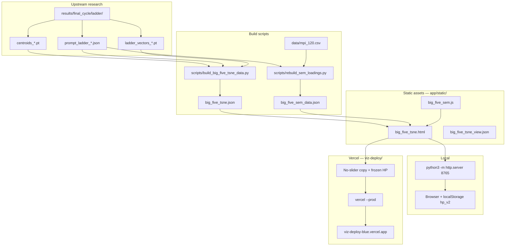

# Big Five combined viz — infrastructure notes

> **Full stack (Gemma, GPU, Unsloth, Vercel, pipelines):** see [INFRASTRUCTURE_OVERVIEW.md](./INFRASTRUCTURE_OVERVIEW.md)  
> **Interpretability (SAE, ablations, trait steerability):** [§7](./INFRASTRUCTURE_OVERVIEW.md#7-interpretability-stack-sae-ablations-polysemanticity)

Last updated: 2026-09-02

This document describes how the **Big Five embedding t-SNE + MPI-120 SEM** visualization is built, served locally, and deployed. It also records what worked, what failed, and how to change things without breaking the layout again.

---

## What this viz is

A single-page, static web app:

| Panel | Content |
|-------|---------|
| **Left** | 3D t-SNE of L15 residual activations from the OCEAN prompt ladder (245 points: level means, variant centroids, ladder vectors). Digman α/β clouds, dividing plane, trait EV labels. |
| **Right** | Force-directed MPI-120 measurement model: five latent traits, top items by \|corr\|, residuals, Digman α/β clique coloring, click-to-focus. |

Cross-panel **hover** links t-SNE dots ↔ SEM nodes. Shared tooltips use **Pearson corr** (keyed item EV vs domain EV), not factor loadings λ.

**Live deploy (no sliders):** https://viz-deploy-blue.vercel.app/big_five_tsne.html  

**Local dev (with sliders):** http://127.0.0.1:8765/big_five_tsne.html

---

## Architecture



---

## File map

### Source of truth (development)

| Path | Role |
|------|------|
| `app/static/big_five_tsne.html` | Combined viz page. **Has layout sliders** and `localStorage` persistence. |
| `app/static/big_five_sem.js` | Shared SEM force graph (used by `big_five_sem.html` and `big_five_tsne.html`). |
| `app/static/big_five_sem_data.json` | MPI-120 items, factor correlations, per-item corr loadings, default top-20 / focus top-8 IDs. |
| `app/static/big_five_tsne.json` | t-SNE coordinates, metadata, EV scores (~147 KB). |
| `app/static/big_five_tsne_view.json` | Snapshot of frozen HP used for deploy; reference only for local tuning. |

### Deploy bundle (production)

| Path | Role |
|------|------|
| `viz-deploy/` | Minimal static folder deployed to Vercel project **`viz-deploy`**. |
| `viz-deploy/big_five_tsne.html` | Same viz **without** `#tsne-controls`; HP hard-coded via `Object.freeze(...)`. |
| `viz-deploy/.vercel/` | Linked Vercel project metadata. |

### Data rebuild

| Script | Input | Output |
|--------|-------|--------|
| `scripts/build_big_five_tsne_data.py` | `results/final_cycle/ladder/` (`.pt` + `prompt_ladder_*.json`) | `app/static/big_five_tsne.json` |
| `scripts/rebuild_sem_loadings.py` | Same ladder JSONs + `data/mpi_120.csv` | `app/static/big_five_sem_data.json` |

After rebuilding JSON, copy into deploy if needed:

```bash
cp app/static/big_five_tsne.json app/static/big_five_sem_data.json app/static/big_five_sem.js viz-deploy/
```

---

## Local development

```bash
cd app/static
python3 -m http.server 8765
# open http://127.0.0.1:8765/big_five_tsne.html
```

### Layout hyperparameters (sliders)

Sliders live in `#tsne-controls` (bottom-left of t-SNE panel). Changes call `saveHp()` → `localStorage` key **`big_five_tsne_hp_v2`**.

| Key | Meaning |
|-----|---------|
| `clusterSpread` | Separates trait clusters in 3D layout (reflows on change). |
| `viewSpan` | Global zoom-out scale on coordinates. |
| `hullSigma` | α/β cloud ellipse size. |
| `hullOpacity` | Cloud fill opacity. |
| `planeOpacity` / `planeSize` | Digman dividing plane. |
| `sizeMean` / `sizeVariant` | Point sizes for level means vs variants. |
| `pointOpacity` | Base point alpha. |
| `selectedBoost` | Selected dot size multiplier. |
| `ladderOpacity` | Ladder direction lines. |
| `cameraDist` | Orbit radius (via `syncCamera()`); **not** full camera pose. |
| `showClouds` / `showVariants` / `showTraitLabels` | Toggles. |

**Camera angle** comes from OrbitControls drag (position relative to target `(0,0,0)`). Only `cameraDist` is on a slider; elevation/azimuth are not persisted unless you add a separate camera save (was attempted briefly via `big_five_tsne_cam_v1`, not in current local build).

### Tuning workflow that worked

1. Tune in **your** browser tab (e.g. `?v=tune1`).
2. Confirm slider readouts + visual match.
3. Capture values from **that tab’s** `localStorage` or screenshots — not from a different browser profile.
4. Bake into `HP_DEFAULTS` (local) and/or frozen `HP` in `viz-deploy/big_five_tsne.html` (deploy).
5. Deploy only from `viz-deploy/` with sliders stripped.

---

## Vercel deployment

```bash
cd viz-deploy
vercel --prod --yes
```

- **Production alias:** https://viz-deploy-blue.vercel.app/big_five_tsne.html  
- **Project:** `shreyaspatel031s-projects/viz-deploy`  
- **Type:** Static files only — no build step, no server.

### Frozen deploy HP (from Cursor browser, 2026-09-02)

Captured from `http://127.0.0.1:8765/big_five_tsne.html?v%3Dtune1`:

| Parameter | Value |
|-----------|-------|
| clusterSpread | 2.38 |
| viewSpan | 0.52 |
| hullSigma | 1.30 |
| hullOpacity | 0.09 |
| planeOpacity | 0.14 |
| planeSize | 1.85 |
| sizeMean | 0.085 |
| sizeVariant | 0.015 |
| pointOpacity | 0.26 |
| selectedBoost | 1.35 |
| ladderOpacity | 0.65 |
| cameraDist | 3.6 |
| showClouds / showVariants / showTraitLabels | true |

Also mirrored in `viz-deploy/big_five_tsne_view.json`.

### Alternate deploy path (repo root)

Root `vercel.json` serves **`app/static`** as `outputDirectory` with `/` → `big_five_tsne.html`. That path includes **sliders** and is a separate Vercel setup from `viz-deploy/`. For the public “clean” link, use **`viz-deploy-blue`**, not ephemeral preview URLs.

---

## SEM module behavior (`big_five_sem.js`)

What shipped and works:

- **Force-directed graph** (not a fixed path diagram) — readable at top-20 scale.
- **Default view:** top **20** items by \|corr\| across all traits.
- **Focus view:** click trait circle → top **8** for that trait; click empty to reset.
- **Loadings:** `corr = Pearson r(keyed item EV, domain EV)` from steered ladder administrations (`rebuild_sem_loadings.py`).
- **Digman α/β:** meta-trait hub on trait focus; hover highlights full α or β clique; rim-trimmed hub arrows.
- **Cross-panel hover:** `#cross-tip` tooltips; t-SNE dims non-matching points; SEM dims non-matching nodes/edges.
- **Trait focus ring** on hovered/selected factor circle.

Related pages (same data, different layouts):

- `app/static/big_five_sem.html` — SEM only.
- `app/static/big_five_linked.html` — experimental linked variant (separate JSON/JS).

---

## What worked

1. **Split local vs deploy HTML** — sliders + `localStorage` for tuning locally; frozen `Object.freeze(HP)` + no controls on Vercel.
2. **Reading live state from the user’s Cursor browser tab** before deploy — avoids guessing HP from code defaults.
3. **Recomputing SEM item edges from steered data** — replaced static/wrong loadings; tooltips and ranking match the experiment.
4. **Top-20 / top-8 focus model** — keeps the graph legible while staying faithful to “show strongest items.”
5. **Shared `big_five_sem.js`** — one implementation for standalone and combined pages.
6. **Static JSON + vanilla Three.js / SVG** — no bundler; `python3 -m http.server` is enough locally; Vercel serves files as-is.
7. **`viz-deploy/` as a dedicated deploy root** — small, explicit artifact set; `vercel --prod` from that folder.
8. **Stable alias `viz-deploy-blue.vercel.app`** — survives per-deploy preview URL churn.
9. **Bumping `HP_STORAGE_KEY` to `v2`** — when baking new defaults without old localStorage overriding them on first load.

---

## What didn’t work (or caused pain)

1. **Removing sliders everywhere** — user still needs local tuning; only deploy should be slider-free.
2. **Wiping `localStorage` on page load** — broke “saved in this browser” and made it look like sliders did nothing.
3. **Freezing layout from the wrong browser/session** — Cursor automation tab vs user’s Chrome tab had different HP; deploy looked wrong until values were read from the correct tab.
4. **Baking camera from `cameraDist` alone** — slider distance ≠ full OrbitControls pose; earlier “locked” camera `(0, 1.138, 3.415)` did not match on-screen orbit. Elevation/azimuth need explicit save if you want pixel-perfect camera lock on deploy.
5. **Half-migrated `VIEW_CONFIG` + removed `bindHyperParams`** — left runtime errors (`saveHp`, `loadCameraConfig` missing). Always finish the migration or keep sliders end-to-end.
6. **Guessing HP from conversation / old snapshots** — values drifted (`1.75` vs `2.38` cluster spread, `0.58` vs `0.52` view span). Screenshot + live tab capture beat defaults in code comments.
7. **Expired Vercel preview URL** — `temporary-brisk-orbit-rvt6kiw.vercel.app` cannot be reclaimed; use `viz-deploy-blue` or re-alias intentionally.
8. **Showing ~29 “traits” in SEM** — early diagram used a small hard-coded item subset; fixed by top-20 ranking over full MPI-120 pool.
9. **Labeling edges as λ (loadings)** — misleading for this steered-data setup; switched to **corr** with explicit formula in legend.
10. **Two deploy configs (`vercel.json` at repo root vs `viz-deploy/`)** — easy to deploy the wrong tree or expect sliders on production.

---

## How to update safely

### Change data (new ladder run)

```bash
python3 scripts/build_big_five_tsne_data.py \
  --vectors-dir results/final_cycle/ladder \
  --out app/static/big_five_tsne.json

python3 scripts/rebuild_sem_loadings.py
# writes app/static/big_five_sem_data.json

cp app/static/big_five_tsne.json app/static/big_five_sem_data.json app/static/big_five_sem.js viz-deploy/
```

### Change layout (local)

1. Tune sliders at http://127.0.0.1:8765/big_five_tsne.html  
2. Export: DevTools → `JSON.parse(localStorage.getItem('big_five_tsne_hp_v2'))`  
3. Update `HP_DEFAULTS` in `app/static/big_five_tsne.html` if you want new code defaults.

### Change layout (deploy)

1. Capture HP from the tuned local tab (not from deploy).  
2. Regenerate `viz-deploy/big_five_tsne.html` from `app/static/big_five_tsne.html`:
   - Remove `#tsne-controls` CSS + `<aside>`.
   - Replace `HP_DEFAULTS` / storage block with `const HP = Object.freeze({ ... })`.
   - Remove `bindHyperParams()` and its call.
3. Update `viz-deploy/big_five_tsne_view.json`.  
4. `cd viz-deploy && vercel --prod --yes`  
5. Verify: no sliders, header shows `cluster spread ×2.38` (or your new value).

---

## Upstream dependency

The viz is only as fresh as **`results/final_cycle/ladder/`**:

- `centroids_{trait}.pt`, `ladder_vectors_{trait}.pt`
- `prompt_ladder_{trait}.json` (administrations with `ev_scores`, `item_log.evs`)

Those come from the broader persona-selection pipeline (Colab/GCP runs, `scripts/final_cycle_run.py`, etc.) — documented elsewhere under `docs/FINAL_CYCLE_PLAN.md` and related files. The viz layer does **not** run the model; it only visualizes exported artifacts.

---

## Quick reference

| Task | Command / URL |
|------|----------------|
| Local server | `cd app/static && python3 -m http.server 8765` |
| Local page | http://127.0.0.1:8765/big_five_tsne.html |
| Production | https://viz-deploy-blue.vercel.app/big_five_tsne.html |
| Deploy | `cd viz-deploy && vercel --prod --yes` |
| HP storage key (local) | `big_five_tsne_hp_v2` |
| Rebuild t-SNE JSON | `scripts/build_big_five_tsne_data.py` |
| Rebuild SEM loadings | `scripts/rebuild_sem_loadings.py` |
