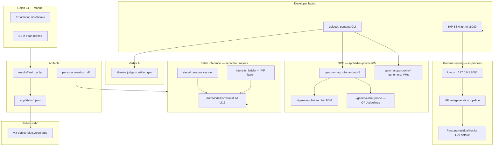
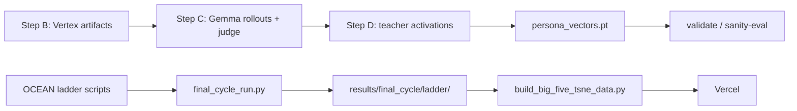
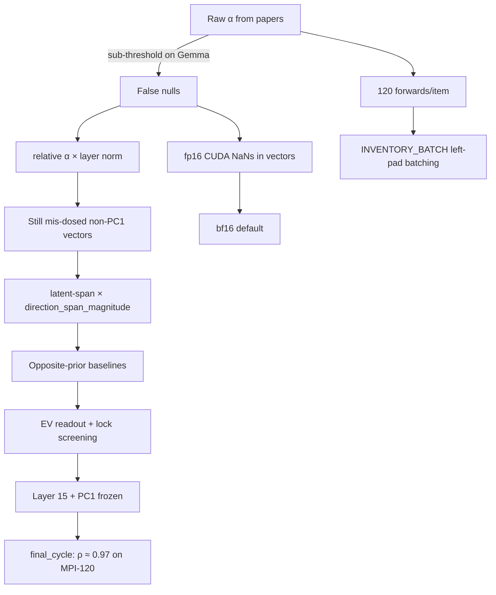
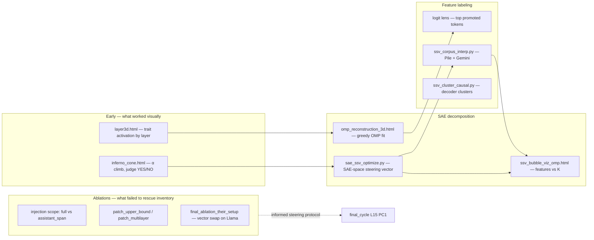

# Persona Selection Model — infrastructure overview

**Purpose:** End-to-end infrastructure reference for interviews and onboarding. Covers Gemma serving on GCE, GPU research pipelines, Vertex AI judging, inference optimizations, static viz deploy, and what actually worked vs failed in production-like use.

**Last updated:** 2026-09-02

**Related:** Narrow viz-only notes live in [BIG_FIVE_VIZ_INFRA.md](./BIG_FIVE_VIZ_INFRA.md).

---

## Executive summary

This repo is a **research + demo stack** for personality steering on **Gemma-3-4B-IT**:

| Layer | Technology | Role |
|-------|------------|------|
| **Serving** | FastAPI + Uvicorn + HF Transformers | Chat, rollouts (HTTP), persona steering hooks, static UI |
| **Batch / research** | In-process `AutoModelForCausalLM` | Activation extraction (step-d), IPIP inventories, OCEAN ladders |
| **Compute** | GCE `gemma-mvp`, ephemeral GPU VMs, manual Colab L4 | No K8s, no Cloud Run, no Terraform |
| **Judge / artifacts** | Vertex AI Gemini | Step B artifact generation, Step C quality filter |
| **Interpretability** | `sae-lens` + SAE-SSV / OMP viz | Prefill SAE snapshots; sparse decomposition for D&D axes; ablations bound inventory write limits (§7) |
| **Public viz** | Vercel static (`viz-deploy/`) | t-SNE + SEM — decoupled from model compute |

**Design tension that shaped the infra:** one **4B model** must serve **HTTP generation** (step-c rollouts) and **teacher forwards** (step-d vectors, batched IPIP). On a **T4 (~16 GB)**, you cannot keep both loaded without **tiered orchestration** (stop Uvicorn → run step-d → restart). That single constraint drove most optimization and failure modes.

---

## System architecture



**Data flow (paper replication pipeline):**



---

## 1. Gemma model serving (FastAPI / Uvicorn)

### Stack

| Component | Path / default |
|-----------|----------------|
| App entry | `app/main.py` |
| Dependencies | `requirements.txt` — `fastapi`, `uvicorn[standard]`, `transformers>=4.51.3`, `torch>=2.4` |
| Default model (server) | `google/gemma-3-4b-it` via `GEMMA_MODEL_ID` |
| Default model (research scripts) | `unsloth/gemma-3-4b-it` (same weights family; see §2) |
| Bind address | **`127.0.0.1:8080`** — never public |
| Access | IAP SSH tunnel only |

### API surface (selected)

| Endpoint | Purpose |
|----------|---------|
| `GET /health` | Model loaded, optional Phase 2 SAE status |
| `POST /chat`, `POST /chat/stream` | SSE streaming chat |
| Persona steer routes | Residual injection at `PERSONA_STEER_LAYER` (default **29**) |
| D&D / gate-chat / static pages | Served from `app/static/` |
| Phase 2 | `POST /phase2/sae_snapshot`, `sae_compare` — prefill SAE |

### Startup behavior

- **`HF_TOKEN`** required for gated weights; without it, `/health` reports `model_loaded: false`.
- Lazy import of `transformers.pipeline` inside lifespan — avoids import failures when torch/vision versions mismatch at module load.
- Device: CUDA device 0 unless `GEMMA_FORCE_CPU=1`.
- Dtype on server: **bf16** on CUDA when supported (mirrors research path fix).

### VM layout (same instance, two trees)

| Directory | Use |
|-----------|-----|
| `~/gemma-chat` | Chat MVP, D&D grid (`scripts/dnd_gemma_mvp.sh`) |
| `~/gemma-chat-probe` | GPU probes, evil-paper replication, tiered pipelines |

**Primary VM:** `gemma-mvp`, project `applied-ai-practice00`, zone `us-central1-a`, typically **`n1-standard-8`** CPU-only; T4 attached on demand.

**Docs:** [VM_GEMMA_MVP.md](./VM_GEMMA_MVP.md), root [README.md](../README.md)

### Local access pattern

```bash
# Terminal 1 — tunnel (IAP required in this org)
./scripts/ssh-tunnel.sh
# → http://127.0.0.1:8080/

# Terminal 2 — chat client (stdlib SSE)
./scripts/gemma-chat

# VM restart
~/gemma-chat/scripts/vm-restart.sh   # sources .hf.env
```

**Security model (interview point):** No public inference endpoint. Loopback bind + IAP SSH + port forward. Tokens in gitignored env files, never committed.

---

## 2. Unsloth — what it is here (and what it isn’t)

| Claim | Reality in this repo |
|-------|----------------------|
| "We use Unsloth for training" | **No.** `unsloth` is **not** in `requirements.txt`. No LoRA/SFT/QLoRA training code. |
| "We use Unsloth for inference" | **Partially.** Research scripts default to HF model id **`unsloth/gemma-3-4b-it`**. Loading is standard **`transformers.AutoModelForCausalLM.from_pretrained`**. |
| Why the Unsloth id? | Unsloth repackages Gemma weights on Hugging Face (often faster/cached hosting). Same architecture as `google/gemma-3-4b-it`. |
| Colab fallback | [E1_COLAB.md](./E1_COLAB.md): `pip install -q unsloth` only **if** vanilla load fails — optional, not default. |
| Server default | **`google/gemma-3-4b-it`** in `app/main.py` and `activations.py` env default |

**Interview line:** *"Unsloth is our preferred HF artifact id for batch research; the serving path uses the official Google id. We did not adopt the Unsloth training stack — steering is activation-based, not fine-tuned."*

---

## 3. GPU / GCP / Colab compute

### 3.1 Persistent VM — `gemma-mvp`

**Cost pattern:** CPU-only by default → **stop VM → attach 1× T4** → install drivers if needed → run GPU job → **detach GPU** → start CPU-only again.

- GPU scheduling: `onHostMaintenance: TERMINATE` (required for attached GPUs).
- Drivers: `nvidia-driver-550-server` on stock Ubuntu, or Deep Learning VM image for new instances.
- PyTorch: **cu128** wheels matched to DLVM / driver stack (`gpu_orchestrate.py` bootstrap).

**Verified (2026-04-01):** T4 + **bf16** step-d → split-half **~0.859**, all-finite persona vectors ([GPU_HOUR_SCOREBOARD.md](./GPU_HOUR_SCOREBOARD.md)).

### 3.2 Ephemeral GPU VMs — `gpu-probe`

**Orchestrator:** `app/persona/gpu_orchestrate.py`  
**CLI:** `python -m app.persona.run gpu-probe`

| Profile (cheapest first) | Machine | GPU |
|--------------------------|---------|-----|
| `n1-8+t4` | `n1-standard-8` | NVIDIA T4 |
| `g2+l4` | `g2-standard-4` | NVIDIA L4 |

**Lifecycle:** `gcloud` create → IAP SSH → sync `app/` + `requirements.txt` + `persona_runs/<run-id>/` → venv + cu128 torch → start Uvicorn (`GEMMA_MAX_NEW_TOKENS=128`, `DISABLE_SAE=1`) → step-c → **delete VM** unless `--keep-vm`.

**Lesson learned:** `n1-standard-4` **OOM** loading Gemma-4B → bumped to **`n1-standard-8`**.

### 3.3 Colab L4 (manual)

| Doc | Workload | Duration |
|-----|----------|----------|
| [E0_COLAB.md](./E0_COLAB.md) | Injection-scope ablation | ~2–3 h |
| [E1_COLAB.md](./E1_COLAB.md) | In-span IPIP redose | ~1–2 h |

Pattern: clone branch → `pip install torch transformers accelerate` → upload tarball (`vecs_probe.tgz`) → run script → download JSON.

**No `colab-cli` in repo** — copy-paste notebook cells only. (Colab CLI was experimented with in agent sessions for `final_cycle_run.py` but is not part of the committed orchestration contract.)

### 3.4 E0 one-shot GCP script

`scripts/run_e0_gcp.sh` — provisions ephemeral VM (L4 then T4 fallback), runs `ablate_injection_scope.py`, pulls results, deletes VM. Defaults to project **`project-amer-scs-sandbox`** (different from main `applied-ai-practice00`).

### 3.5 Not present

- Docker / container images
- Terraform / Pulumi / IaC
- Kubernetes, Cloud Run, GKE
- Cloud Composer, Dataflow, Beam
- Horizontal autoscaling for inference

---

## 4. Inference & memory optimizations

These are the optimizations that materially changed throughput, cost, or correctness.

### 4.1 Dtype: bf16 default on CUDA (critical fix)

**File:** `app/persona/activations.py` → `_pick_model_dtype()`

| Setting | Behavior |
|---------|----------|
| CUDA default | **bfloat16** when supported |
| CUDA opt-in fp16 | `PERSONA_CUDA_ALLOW_FP16=1` — **may NaN** |
| CPU default | fp32; optional `PERSONA_CPU_DTYPE=bf16` for memory |

**Failure:** Old code used **fp16 on T4** → **NaN persona vectors** from mid-layers (`gpu_nan_repro`, `evil_scale_v0`). CPU fp32 on same data was healthy (split-half ~0.865).

**Fix outcome:** bf16 on T4 → finite `v`, split-half ~0.86. Documented in [GPU_HOUR_SCOREBOARD.md](./GPU_HOUR_SCOREBOARD.md).

### 4.2 Tiered Uvicorn (memory orchestration)

**Problem:** Step-d loads a **second** full Gemma in-process while Uvicorn already holds the 4B pipeline → **T4 OOM**.

**Pattern:** Scripts like `_remote_tiered_probe_pipeline.sh`:

1. Run step-c with Uvicorn up (HTTP rollouts).
2. **Stop Uvicorn.**
3. Run step-d (teacher forwards only).
4. Run validate / sanity-eval.
5. Optionally restart Uvicorn.

**Interview line:** *"We treated the inference server and the teacher model as mutually exclusive on 16 GB GPUs — orchestration, not a bigger box."*

### 4.3 Batched IPIP administration (left-padded — added later)

**Problem (original path):** Each MPI-120 / IPIP item was a separate forward pass — **120 forwards per administration**. Final-cycle and OCEAN sweeps run thousands of administrations (variants × rungs × traits × controls). At one forward per item, the run blew the **<100k forward-pass budget** and wall-clock time on T4.

**Solution (later addition):** `_administer_batched()` in `app/persona/intensity_ladder.py` — score **up to N items in one forward** (default **N=16** via `INVENTORY_BATCH`), returning all Likert responses and optional layer activations at once.

#### How it works

```
Before (unbatched):  item₁ → forward → item₂ → forward → … → item₁₂₀ → forward   (120 passes)
After (batched):     [item₁…item₁₆] → one padded forward → all 16 logits + acts   (8 passes for 120 items)
```

1. **Tokenize each item** as an independent chat turn: `system + user(item) + generation_prompt`.
2. **Left-pad** every sequence in the chunk to the **max length in the batch**:
   - `ids[i, width - length : width] = seq`
   - `attention_mask` marks real tokens only.
3. **Why left-pad (not right-pad):** After padding, the **last non-pad position is always the answer slot** for every row. One slice `logits[:, -1, :]` yields constrained Likert logits for **all items in the batch** simultaneously.
4. **Single `model(input_ids, attention_mask)`** — no generation loop; constrained readout from last-position logits over option token ids (`_likert_from_logits`).
5. **Activation capture without OOM:** Instead of `output_hidden_states=True` (materializes **every position × every layer** — explodes VRAM at batch 16), register **per-layer forward hooks** that copy only `h[:, -1, :]` (answer position) to CPU. Stack → `(n_layers, batch, d)` → split per item → mean for centroid.
6. **Steering hooks stay batch-aware:** When `_Steering` uses `scope="assistant_span"`, `inventory_assistant_starts_padded()` computes each row's assistant-span start **after** left-pad offset (`unpadded_start + pad_left`) so injection hits the correct tokens per row.
7. **OOM backoff:** On `torch.cuda.OutOfMemoryError`, halve `batch` and retry the same chunk (down to 1). Tune with `INVENTORY_BATCH` env var.

#### API surface

```python
administer_inventory(..., batched=True)   # default — uses _administer_batched
administer_inventory(..., batched=False)  # legacy one-forward-per-item path
administer_inventory(..., max_batch=8)    # override env default
```

**Env:** `INVENTORY_BATCH` (default **16**)

#### Correctness notes (documented in code)

| Topic | Detail |
|-------|--------|
| **Accuracy** | Items are independent single-turn prompts — batching does not change the scoring math vs unbatched. |
| **Activation semantics** | Batched path uses **raw block outputs** from hooks at all layers; unbatched path mixed raw layers with a final normed layer. Layers below the last match to **~4e-5**; batched path is **more consistent** with what the steering hook perturbs. |
| **Steering span** | Full-form steering (`scope="full"`) and assistant-span steering both work; span mode requires per-row start indices in padded batches. |

#### Where it is used

| Consumer | Impact |
|----------|--------|
| `scripts/final_cycle_run.py` | Every phase that calls `administer_inventory()` — reliability gate, prompt ladder, steering sweeps, controls |
| `scripts/run_ocean_vectors.py` / intensity ladder CLI | OCEAN PC1 validation sweeps |
| `app/persona/intensity_ladder.py` | Prompt-ladder centroids, α-sweeps, opposite-prior runs |

**Rough speedup:** For a 120-item form, **120 → 8 forwards** at batch 16 (~**15×** fewer passes per administration), before GPU matmul efficiency gains. This is what made the final-cycle **<100k forward budget** achievable on a single T4 load.

**Interview line:** *"We batch independent inventory items with left-padding so the answer token aligns at position -1 for every row — one forward pass returns all Likert scores and last-token activations, with hooks instead of hidden_states to stay inside VRAM."*

### 4.4 Token and probe caps

| Knob | Default | Why |
|------|---------|-----|
| `GEMMA_MAX_NEW_TOKENS` | 256 (server), **128** (gpu-probe) | Rollouts are short; judge dominates wall time |
| `DISABLE_SAE=1` on probes | Skip SAE load | Saves VRAM on probe VMs |
| Phased probes | tiny → medium → scale | [GPU_PROBE_WORKFLOW.md](./GPU_PROBE_WORKFLOW.md) stop/go gates |

### 4.5 Artifact slimming for Colab

Full `ladder_vectors_*.pt` uploads unreliable on Colab → **`slim_{trait}.pt`** (layer-15 only, ~4 MB) workaround documented in pipeline notes.

### 4.6 Not used (explicit gaps)

- 4-bit / 8-bit quantization (bitsandbytes, GPTQ)
- vLLM, TensorRT-LLM, TGI
- torch.compile / FlashAttention as a standard path
- Separate dedicated inference microservice

---

## 5. Research pipelines

### 5.1 Persona paper replication (Steps B → C → D)

| Step | Module | Compute | Output |
|------|--------|---------|--------|
| **B** | `app/persona/artifact_gen.py` | Vertex Gemini | Contrast pair artifacts |
| **C** | `app/persona/rollouts.py`, `judge_vertex.py` | Gemma **HTTP** + Vertex judge | `rollouts/rollouts.jsonl` |
| **D** | `app/persona/activations.py` | Gemma **in-process** teacher | `vectors/persona_vectors.pt` |
| **Validate** | `app/persona/quality_gates.py` | CPU/GPU | `validation_report.json` |

**CLI hub:** `python -m app.persona.run` — subcommands `step-b`, `step-c`, `step-d`, `validate`, `gpu-probe`, `intensity-ladder`, etc.

**Output convention:** `persona_runs/<run_id>/` (gitignored) — see [directory_structure.md](./directory_structure.md).

**Orchestration scripts:** 13× `scripts/_remote_*.sh` for tiered/evil/chaos/scale pipelines on VM.

### 5.2 OCEAN / intensity ladder

| File | Role |
|------|------|
| `scripts/run_ocean_vectors.py` | One-command OCEAN validation |
| `app/persona/intensity_ladder.py` | Prompt ladder, centroids, PC1 vectors, α-sweep |
| `app/persona/intensity_prompts.py` | Calibrated trait prompts |
| `app/persona/inventory_ipip.py` | Constrained Likert readout (argmax / EV) |
| `docs/INTENSITY_LADDER_CAA.md` | Method write-up |
| `docs/OCEAN_VECTOR_VALIDATION.md` | Validation protocol |

**Stages:** prompt-ladder → centroids → PC1 direction → validated α-sweep with bipolar + random controls.

### 5.3 Final cycle (defensibility run)

**Script:** `scripts/final_cycle_run.py`  
**Plan:** [FINAL_CYCLE_PLAN.md](./FINAL_CYCLE_PLAN.md)  
**Results:** [RESULT_PERSONALITY_CONTROL.md](./RESULT_PERSONALITY_CONTROL.md)

Design constraints:

- **One model load** per run
- **Layer 15 only** (residual activations)
- **MPI-120 primary** instrument
- **<100k forward passes** budget
- Incremental JSON writes under `results/final_cycle/` (kill-safe)

Phases: reliability gate → prompting baseline → L15 extraction → steering sweeps → analysis.

```bash
python3 scripts/final_cycle_run.py \
  --out-dir results/final_cycle \
  --items-csv data/mpi_120.csv
```

### 5.4 Instruments (committed data)

| File | Items |
|------|-------|
| `data/mpi_120.csv` | MPI-120 (primary) |
| `data/ipip_neo_120.csv` | IPIP-NEO-120 |
| `data/ipip_neo_facets_300.csv` | Facet-level 300 |
| `data/goldberg_markers_104.json` | Published marker set |

---

## 6. Steering vectors & alpha procedures

This section is the steering “lab notebook”: every α/direction/baseline protocol tried, what failed, and what **final cycle** settled on. Code lives mainly in `app/persona/intensity_ladder.py`, `scripts/run_ocean_vectors.py`, and `scripts/final_cycle_run.py`.

### 6.1 The steering primitive (unchanged throughout)

All paths use the same hook:

```text
h ← h + α · v̂        at one transformer layer
```

- `v̂` = unit-normalised direction in residual space (2560-d on Gemma-3-4B).
- `α` = scalar **magnitude** (what every “alpha procedure” below tries to get right).
- **Injection scope** (also varied):
  - **`full`** (default) — every token position in the inventory forward (~65 positions on IPIP/MPI forms). Historical protocol.
  - **`assistant_span`** — only from generation-prompt boundary through answer slot (~3–4 positions), matching Blas et al. inventory injection.

### 6.2 Direction candidates (geometry stage)

From nine prompt-ladder level centroids, four directions were saved per layer (`vectors` / `build_ladder_vectors`):

| Direction | Definition | Role |
|-----------|------------|------|
| **`v_endpoint`** | Mean-difference / classic CAA: centroid(L9) − centroid(L1) | Paper baseline; often **off-ladder** if PC1 ≠ endpoint |
| **`v_pc1`** | First principal axis of level centroids (sign-aligned to endpoint) | **Final choice** — best ordered span at L15 for most traits |
| **`v_ordinal`** | Minimum-norm LS fit: predict level from activation | Graded axis alternative |
| **`v_probe`** | Ridge regression of level on activation | “Graded” direction; OCEAN pipeline default early on |

Layer selection evolved:

| Method | How | Failure mode |
|--------|-----|--------------|
| Geometry `best_layer` | max(monotone × PC1 variance × \|ρ\|) | Picked layers where direction was **global gain**, not trait axis (e.g. neuroticism L10: 97.5% mean-residual leak) |
| Span-first | max projection span along direction | Agreeableness L20: huge span, **weaker** steering than random at judge |
| **`resolve_steering_layer_for_direction`** | Rank by Spearman × monotone on **the vector being injected**; tie-break on span | Fixed agreeableness dosing (53-unit grid at wrong layer → 819-unit grid at L15) |

**Final cycle freeze:** extract all layers for diagnostics, but **steer only at layer 15** — no post-hoc layer search on sweep results ([FINAL_CYCLE_PLAN.md](./FINAL_CYCLE_PLAN.md)).

### 6.3 Alpha / magnitude procedures tried

#### A. Raw α from literature (`alpha_units="raw"` or copied constants)

| What | Example | Why it failed |
|------|---------|---------------|
| Paper α ≈ 2 on unit-norm **v** | Blas et al. style | Gemma L15 mean residual norm ~**2.7×10⁴**; effective `‖α·v‖` ~2 is a **no-op** |
| Fixed grid 0…2 without calibration | Early OCEAN sweeps | Same — testing sub-threshold region where even known-good vectors score 1/100 |

**Evidence:** Known-good alignment vector at L15: nothing moves inventory until `‖α·v‖ ≳ 1800` ([OCEAN_VECTOR_VALIDATION.md](./OCEAN_VECTOR_VALIDATION.md)).

#### B. Relative α (`alpha_units="relative"`)

Scale each α by **mean activation L2 norm at the layer** (arXiv:2604.14463 calibration):

```text
α_effective = α × mean(‖h_ℓ‖ across ladder centroids)
```

| Pros | Cons |
|------|------|
| Transfers across layers/models better than raw | Still uses **layer mean norm**, not **trait latent span** — can mis-dose if direction ≠ PC1 |

Used in `run_alpha_sweep()` and early validated sweeps. Superseded for final claims by **latent-span units** (below).

#### C. Latent-span dosing (settled for final cycle)

Express magnitude in units of **how far prompting moves along the steered direction**:

```text
span = | proj( centroid_L9 − centroid_L1 , v̂ ) |   at layer L
magnitude = sign × span × frac     where frac ∈ [0.15, 1.30] × 8 rungs
```

Implemented via `direction_span_magnitude()` — **must use the same v̂ being injected**, not PC1 span for a probe vector (up to **10×** dose error).

**Why it mattered:** Conscientiousness looked like a null at grid top 476; rescaling grid to direction span **1976** → ρ = 1.00, 98% of prompt gap ([results/bipolar/README.md](../results/bipolar/README.md)).

#### D. Auto-calibrated grid (`run_ocean_vectors.py`)

Default when `--magnitudes` empty:

- Build grid as **0.25×, 0.5×, 1×, 1.5×, 2× latent span**
- Clip by **coherence ceiling** (largest magnitude still producing non-degenerate prose)
- `--no-auto-calibrate` to force explicit `--magnitudes`

#### E. Opposite-prior baselines (settled for bipolar sweeps)

| Pole | Baseline prompt | Steer | Reference prompt |
|------|-----------------|-------|------------------|
| **Up** | Level **2** (low-trait) | **+v** | Level **9** |
| **Down** | Level **8** (high-trait) | **−v** | Level **1** |

**Why:** RLHF-tuned Gemma is already high-C, high-A. Steer-up from level-5 midpoint had **~0.87** headroom up vs **3.13** down — upward sweeps looked null by construction. Opposite-prior gives room in the intended direction ([RESULT_PERSONALITY_CONTROL.md](./RESULT_PERSONALITY_CONTROL.md)).

Failed baselines kept for comparison only:

| Baseline | Problem |
|----------|---------|
| **`neutral_level5`** / level-5 ladder prompt | Pins inventory near neutral; not a fair unsteered reference for sweeps |
| **`persona_free` only** (no opposite prior) | Valid for reliability gate; insufficient headroom for up-pole sweeps on prior-resident traits |

### 6.4 Scoring & readout procedures tried

| Readout | Used when | Failure mode |
|---------|-----------|--------------|
| **Argmax** over Likert option tokens | Early sweeps | Looks fine while model **locks** one option — acquiescence correction still yields midpoint **3.0** with validity 1.0 |
| **Expected value (EV)** over option probs | **Final cycle primary** | Keeps graded signal after argmax saturates |
| No lock screening | Early runs | Locked rungs counted as real measurements → fake flat or monotone curves |
| **`option_lock()` + entropy screen** | Final protocol | Locked rungs = **missing data**; ≥90% one option or entropy < 0.30 nats |

Additional quality gates on OCEAN path:

- **`control_margin_ratio ≥ 2.0`** — beat matched-norm random at same dose
- **`refusal_score()`** — disclaimer collapse produces real ρ for wrong reason
- **Coherence ceiling** — prose degeneracy before inventory “moves”
- **Free-text probes + marker rates** — inventory moved but model stopped answering as self

### 6.5 Injection scope experiments

| Scope | Positions perturbed | Result |
|-------|---------------------|--------|
| **`full`** | ~65 (whole inventory context) | **Final cycle default** — inventory moves with MPI-120 EV readout |
| **`assistant_span`** | ~3–4 (answer slot only) | E0 ablation (`scripts/ablate_injection_scope.py`); weaker on inventory; closer to Blas paper protocol |

Stride / multi-position ablations (E0, [EMAIL_AND_DIFF_TEST_PLAN.md](./EMAIL_AND_DIFF_TEST_PLAN.md)): denser injection expected to strengthen effect; tested via `ablate_injection_scope.py` on Colab/GCE — **full form** remained primary for defensibility runs.

### 6.6 Direction & layer failures (specific hypotheses ruled out)

Documented in [results/patch_bound/CONCLUSION.md](../results/patch_bound/CONCLUSION.md) and ladder geometry diagnostics:

| Hypothesis | Verdict |
|------------|---------|
| Dose too small | Ruled out after span calibration |
| Wrong baseline (level-5) | Real bug, fixed — did not alone rescue early nulls |
| Wrong pole only | Both poles swept |
| Gate too strict (Δ=0 auto-fail) | Fixed — did not rescue |
| Wrong layer (geometry vs injection span) | Real bug, fixed — major for agreeableness/C |
| PC1 is low/high switch not dial | Partially true; ridge **probe** recovers graded axis (held-out ρ 0.94–1.00) but thinner slice of displacement |
| **Full layer displacement patch** reproduces prompt | **No** — patch captures **≤29%** of prompt separation; rank-1…8 truncations no better → prompted trait effect not a single-layer additive offset |
| Multilayer steering | Explicitly **closed** for final cycle (`results/patch_multi/`) |

**Important nuance for interviews:** The patch upper bound showed **full activation displacement** at one layer cannot reproduce prompting. Final cycle still found **a single PC1 direction at L15** with span-calibrated α produces **monotone MPI-120 EV movement** (median ρ = 0.97) — a **narrower, direction-specific** intervention than “replace the whole prompted state.” Reading (ridge on activations) and writing (residual add) are decoupled.

### 6.7 What we settled on (canonical protocol)

This is the locked protocol in `scripts/final_cycle_run.py` and reported in [RESULT_PERSONALITY_CONTROL.md](./RESULT_PERSONALITY_CONTROL.md):

| Choice | Value |
|--------|-------|
| **Model** | `unsloth/gemma-3-4b-it` (Gemma-3-4B-IT) |
| **Layer** | **15** only (frozen before sweeps) |
| **Direction** | **PC1** across nine ladder level centroids, unit-normalised |
| **Magnitude** | `α = sign × span × frac`; span = `direction_span_magnitude(L15, v_pc1)`; frac **0.15–1.30** × 8 rungs |
| **Injection** | **`full`** scope, additive residual hook |
| **Baseline** | **Opposite-prior** (L2 up / L8 down) |
| **Instrument** | **MPI-120** (`data/mpi_120.csv`), all 120 items every rung |
| **Readout** | **Expected value** over Likert option token probs |
| **Controls** | Matched-norm **random** direction(s); **−v bipolar** sign flip; off-target domain deltas |
| **Screens** | Option lock / entropy; per-rung item σ; forward-reverse keying diagnostic |
| **Pass gates** | ρ ≥ 0.8, margin vs random ≥ 2×, ≥4 usable rungs, Cronbach α gate in phase 1 |

**Headline result:** median dose-response **ρ = 0.97**; mean bipolar range **2.62 / 4** Likert points; 8/10 poles beat random at matched dose.

**Known exceptions:** Agreeableness-up weak at some layer choices; neuroticism-up ρ = 0.60; extraversion partial in some earlier runs — reported, not hidden.

### 6.8 Chronology (for “tell me about a hard infra problem” stories)



### 6.9 Key files & commands

| Task | Command / file |
|------|----------------|
| Full defensibility run | `python3 scripts/final_cycle_run.py --out-dir results/final_cycle` |
| OCEAN validation (auto-span grid) | `python3 scripts/run_ocean_vectors.py --run-id ocean_v1 --all-traits` |
| Alpha sweep only | `python -m app.persona.run intensity-ladder -- alpha-sweep --direction pc1 --alpha-units relative` |
| Injection scope ablation | `python3 scripts/ablate_injection_scope.py` |
| Patch upper bound | `python3 scripts/patch_upper_bound.py` |
| Bipolar + judge | `python3 scripts/bipolar_judge.py` |
| Geometry diagnostic | `python3 scripts/diagnose_ladder_geometry.py` |

---

## 7. Interpretability stack (SAE, ablations, polysemanticity)

The interpretability layer runs **parallel** to the inventory-steering pipeline: it explains and composes persona directions (D&D Good/Evil, alignment axes) using **Gemma Scope 2 SAEs**, not the same code path as final-cycle MPI-120 sweeps. What worked early, what failed, and what we settled on.

### 7.1 Stack overview (Inferno viz series)



**Hub:** `app/static/viz_series.html` — six-chapter narrative (layer → cone → OMP → bubbles → composition board → Big Five silhouette).

### 7.2 Phase 2 SAE (server-integrated baseline)

**Module:** `app/phase2.py` · **`sae-lens>=6.39,<7`**

| Mode | Default | Role |
|------|---------|------|
| **Chat MVP SAE** | `gemma-scope-2-4b-it-res`, `layer_22_width_16k_l0_medium` | Loaded at Uvicorn startup unless `DISABLE_SAE=1` |
| **Persona / D&D experiments** | `gemma-scope-2-4b-it-res-all`, `layer_31_width_16k_l0_small` | `load_sae_for_layer()` for per-trait work |

**API:** `POST /phase2/sae_snapshot`, `sae_compare` — **prefill-only** last-token codes; Jaccard overlap between two system prompts.

**What worked:** Quick “are these two prompts different in SAE space?” demos on the chat server.

**What didn’t / limits:** Prefill-only (no per-token SAE during generation); heavy on CPU; **`DISABLE_SAE=1`** on all GPU probe VMs to save VRAM. Neuronpedia had no coverage for our **L16 262k** persona SAE — drove custom tooling below.

### 7.3 SAE-SSV + OMP (persona steering decomposition)

**Goal:** Decompose a dense residual steering vector into sparse SAE features and optimize a steering vector **in SAE latent space** (He et al. EMNLP 2025 `L_steer` objective).

| Component | Path | Role |
|-----------|------|------|
| SAE-SSV optimize | `scripts/sae_ssv_optimize.py` | F-stat feature selection → optimize `v` in SAE space → decode via `W_dec` → judge at multiple α |
| OMP reconstruction | `app/static/omp_reconstruction_3d.html` | Greedy OMP: how many SAE features to reconstruct the alignment vector? |
| Bubble viz | `ssv_bubble_viz_omp.html`, `rebuild_ssv_bubble_viz_omp_data.py` | Which features activate as sparsity budget K grows |
| Galaxy / trajectory | `ssv_galaxy.html` | 3D layout of feature trajectories across K |

**What worked early:**
- **D&D Good/Evil cone** (`inferno_cone.html`) — behavioral α climb with Vertex judge; clean YES/NO flips at L15.
- **Layer viz** — trait activation peaks at mid/late layers; motivated L15/L16 as steering sites.
- **OMP fit** — alignment vectors **do** reconstruct from a small SAE subset; bubbles make “what lights up” tangible for demos.

**What didn’t:**
- **SAE-SSV as replacement for residual PC1 on MPI-120** — not the path that produced final-cycle ρ ≈ 0.97; SAE-SSV stayed on **judge-scored rollouts**, not inventory EV sweeps.
- **Assuming SAE features are monosemantic** — many top features labeled **“polysemantic”** or Unicode/sub-token junk; see §7.5.

**Settled on:** SAE stack for **interpretability narrative** (blog Act 1: cone → OMP → bubbles → composition board). **Steering claims** on Big Five use **residual PC1 @ L15**, not SAE-decoded vectors.

### 7.4 Feature labeling & polysemanticity

Features must be named for bubble viz and cluster causal tests. Three label sources, strict priority in `rebuild_ssv_bubble_viz_omp_data.py`:

| Priority | Source | Script |
|----------|--------|--------|
| 1 | **Lens Gemini** (structured title/desc on logit-lens evidence) | `ssv_corpus_interp` / lens interp JSON |
| 2 | **Corpus Gemini** (Pile stream + detection test) | `scripts/ssv_corpus_interp.py` |
| 3 | **Logit lens** (top promoted/suppressed tokens) | Cached per feature |

**Polysemanticity handling:**
- Labels titled **`"polysemantic"`** are **dropped** (`_good_lens_title` returns empty) — do not show as trait labels in viz.
- Corpus interp explicitly targets features Neuronpedia/Delphi don’t cover for **L16 262k**.
- **`ssv_lens_themes.py`** — theme bucketing from lens/corpus text; suppress labels for anti-features.

**What worked:** Corpus + Gemini autointerp on high-|weight| SSV features; logit lens as fallback when interp fails.

**What didn’t:** Treating every active bubble as “a trait neuron”; many features are format/Unicode/polysemantic. **Cluster causal** (`ssv_cluster_causal.py`) groups decoder-similar features but still needs human-readable labels to be meaningful.

### 7.5 Ablation program (inventory-focused)

These ablations bound **what residual steering can and cannot do** on MPI-120 / IPIP — separate from SAE demos.

#### E0 — Injection scope (`scripts/ablate_injection_scope.py`)

**Hypothesis:** Inventory dose-response needs **full-sequence** injection (~65 positions); Blas-style **assistant_span** (~3–4 positions) collapses signal.

| Pole | `full` span | `assistant_span` span | Supported (margin ≥2× control)? |
|------|-------------|----------------------|--------------------------------|
| C-down | 1.42 | 0.13 | **full yes** (hypothesis confirmed for this pole) |
| C-up | 0.54 | 0.33 | no / no |
| E-up | 0.67 | 0.08 | no / no |

**Result:** Mixed — only C-down clearly beat span mode under early argmax readout. **Final cycle kept `full` injection** for defensibility (inventory administers long context per item).

#### Patch upper bound (`scripts/patch_upper_bound.py`, `results/patch_bound/`)

Inject the **full prompted displacement** (L9 − L1 centroid vector), not a learned direction.

| Trait | Prompt hi−lo | Patch recovers |
|-------|--------------|----------------|
| Extraversion | +3.26 | **21%** |
| Openness | +1.72 | **29%** (best) |
| Conscientiousness | +4.00 | **3%** |

**Conclusion:** Prompt effect is **not** a single-layer additive offset. Rank-1…8 truncations don’t help. Activations **read** trait level (ridge held-out ρ 0.94–1.00) but are **not fully writable** by patch — reading ≠ writing.

#### Multi-layer patch (`results/patch_multi/`)

Patch same displacement at **9, 17, or all 34 layers** simultaneously.

**Result:** **Worse than single layer** — mid-band and all-layer patches lock inventory at ~3.0. Multi-layer SAE interpretation does **not** reopen residual write path for this target.

**Settled:** **Single layer L15 only** for final cycle; multilayer search explicitly **closed** ([FINAL_CYCLE_PLAN.md](./FINAL_CYCLE_PLAN.md)).

#### Final ablation — their setup (`scripts/final_ablation_their_setup.py`)

Hold Blas setup constant (Llama-3.1-8B, MPI-120, argmax, full injection); swap only vector estimator:

- `theirs_meandiff_statement` vs `ours_endpoint` vs `ours_pc1`

**Purpose:** Separate **corpus** vs **estimator** — not to claim full recovery. Endpoint vs PC1 cos ≈ **0.99** on ladder data anyway ([DELTA_VS_PSYCHOLOGICAL_STEERING.md](./DELTA_VS_PSYCHOLOGICAL_STEERING.md)).

#### Other ablations (closed or secondary)

| Ablation | Verdict |
|----------|---------|
| `ablate_injection_scope.py` (E0) | Informed scope choice; not sole gate for final success |
| `measure_injection_span.py` | Characterize assistant span lengths |
| `patch_multilayer.py` | Multi-layer write fails |
| `scripts/e1_vector_headtohead.py` | Their MDS vector vs our PC1 on same grid |
| Injection stride (EMAIL plan) | Denser injection helps in theory; inventory protocol stayed full-form |

### 7.6 Trait difficulty — easy vs hard to steer

Two measurement modes give **different** difficulty orderings:

#### A. MPI-120 inventory EV (final cycle — `RESULT_PERSONALITY_CONTROL.md`)

**Easy (strong ρ, large bipolar range, beat random):**

| Trait | ρ up / ρ down | Bipolar range | Notes |
|-------|---------------|---------------|-------|
| **Conscientiousness** | 0.98 / 1.00 | **3.67** | Largest movement; 8/8 specificity poles beat random |
| **Extraversion** | 0.88 / 0.95 | **3.57** | Strong inventory curves after opposite-prior fix |
| **Openness** | 0.95 / 1.00 | 1.69 | Clean both poles |
| **Agreeableness** | 1.00 / 0.85 | 2.42 | Up strong; **down** sometimes loses to random at matched dose |

**Harder:**

| Trait | Issue |
|-------|-------|
| **Neuroticism up** | ρ = **0.60** (weakest pole); prior/headroom — model not high-N by default |
| **Agreeableness up** (judge path) | Failed bipolar judge pass at L20 (margin 0.36 vs random); **inventory** ρ still 1.00 up |
| **Extraversion** (dose-matched v3) | Blog notes E-up/E-down **failed** dose-matched control in one sweep generation — partial/messy before opposite-prior repair |

**Cronbach α gate:** all five traits 0.78–0.94 on MPI-120 — instrument works on model before steering claims.

#### B. Free-text / Vertex judge (bipolar_judge, inferno cone)

**Easy:**
- **Extraversion** — 102% of prompt gap both directions at L15 (judge score).
- **Conscientiousness** — 98% / 92% after span dosing fix.

**Hard:**
- **Agreeableness up** — 18% of prompt gap; random beats trait (L20); ladder weakly ordered (ρ 0.83, monotone 0.62) vs L15 (ρ 1.0).
- **Openness up** — 71% of gap (inventory stronger than judge narrative).

**Pattern:** **Inventory EV + opposite-prior + lock screen** is more forgiving than **judge-scored free text** for agreeableness and neuroticism. **Behavioral / SJT-style** measures (Blas et al.) showed the same split — inventories move when SJTs looked flat or vice versa.

#### C. Big Two / metatrait structure (`big_two_final_cycle.py`)

On inventory scores after final cycle: **16/16** predicted α/β sign pairs matched (vs Blas **46%** on SJTs). **α (C, A, N−)** gives **drift-discordant** checks (N must move opposite global slide) — strongest evidence against “global degradation” confound.

### 7.7 What we settled on (interpretability vs steering)

| Layer | Settled approach |
|-------|------------------|
| **Demo / blog / D&D** | Layer viz → inferno cone → OMP/SSV bubbles → composition board; Phase 2 SAE snapshots on server |
| **Feature labels** | Corpus Gemini > lens Gemini > logit lens; **drop** polysemantic junk labels |
| **SAE steering vector** | SAE-SSV for alignment-axis **experiments**; not the published Big Five inventory result |
| **Inventory steering** | Residual **PC1 @ L15**, latent-span α, full injection, opposite-prior, EV readout (§6) |
| **Ablations** | Patch + multilayer write **failed** → single-layer protocol frozen; E0 informed full vs span |
| **Honesty** | 5/10 poles pass dose-matched control in one v3 sweep; final cycle ρ table is stronger but **E partial, N-up weak, A-down noisy** |

**Interview line:** *"SAE decompositions explained the Good vector for humans; they didn't replace the residual steering protocol that moved MPI-120. Polysemantic features are everywhere — we label hierarchically and hide junk. Patch ablations proved you can't paste the whole prompt into one layer, but a single PC1 direction still dials EV — trait-dependent strength."*

### 7.8 Key files

| Topic | Paths |
|-------|-------|
| Phase 2 SAE | `app/phase2.py`, `app/static/phase2.html` |
| SAE-SSV | `scripts/sae_ssv_optimize.py`, `scripts/_remote_ssv_optimize_only.sh` |
| Corpus interp | `scripts/ssv_corpus_interp.py` |
| OMP / bubbles | `app/static/omp_reconstruction_3d.html`, `scripts/rebuild_ssv_bubble_viz_omp_data.py` |
| E0 scope | `scripts/ablate_injection_scope.py`, `results/injection_scope_ablation/` |
| Patch bounds | `scripts/patch_upper_bound.py`, `results/patch_bound/`, `results/patch_multi/` |
| Trait difficulty | `docs/RESULT_PERSONALITY_CONTROL.md`, `results/bipolar/`, `results/dose_matched_control.json` |
| Blog narrative | `docs/blog/persona-selection-model-blog.md`, `viz/DESIGN_SYSTEM.md` |

---

## 8. Vertex AI (judge + artifacts)

| Use | SDK | Notes |
|-----|-----|-------|
| Step B artifact generation | `google-cloud-aiplatform` | Trait contrast prompts |
| Step C rollout judging | Vertex Gemini (e.g. 2.5 Flash) | Keep/discard generations |

**Env:** `GOOGLE_CLOUD_PROJECT`, `VERTEX_LOCATION` (default `us-central1`).

**Observed:** Tiny probes ~**70%** judge keep-rate; judge wall time often dominates step-c even when Gemma is on GPU (~7.6× speedup vs CPU for generation alone).

---

## 9. Static visualization & Vercel

Research artifacts → static JSON → browser viz. **No model on Vercel.**

### Build chain

```
results/final_cycle/ladder/
  → scripts/build_big_five_tsne_data.py  → big_five_tsne.json
  → scripts/rebuild_sem_loadings.py      → big_five_sem_data.json
  → app/static/big_five_tsne.html + big_five_sem.js
  → viz-deploy/ (sliders stripped, HP frozen)
  → vercel --prod
```

### Deploy split (important)

| Path | Sliders | URL pattern |
|------|---------|-------------|
| `app/static/` (local) | **Yes** + `localStorage` `big_five_tsne_hp_v2` | `python3 -m http.server 8765` |
| `viz-deploy/` (prod) | **No** — `Object.freeze(HP)` | https://viz-deploy-blue.vercel.app/big_five_tsne.html |
| Root `vercel.json` | Serves `app/static` (includes sliders) | Alternate deploy — easy to deploy wrong tree |

**Production alias:** `viz-deploy-blue.vercel.app`  
**Deploy command:** `cd viz-deploy && vercel --prod --yes`

**Frozen deploy HP (2026-09-02, from Cursor browser tune session):**

| Parameter | Value |
|-----------|-------|
| clusterSpread | 2.38 |
| viewSpan | 0.52 |
| hullSigma | 1.30 |
| pointOpacity | 0.26 |
| ladderOpacity | 0.65 |
| cameraDist | 3.6 |
| (full set) | `viz-deploy/big_five_tsne_view.json` |

Detail: [BIG_FIVE_VIZ_INFRA.md](./BIG_FIVE_VIZ_INFRA.md)

---

## 10. Secrets & configuration

### Gitignored

`.env`, `.hf.env`, `.gemma_hf.env`, `secrets/`, `persona_runs/`

### Key environment variables

| Variable | Purpose |
|----------|---------|
| `HF_TOKEN` | Gated Gemma weights |
| `GOOGLE_CLOUD_PROJECT` | GCP + Vertex |
| `GEMMA_MODEL_ID` | Server model id |
| `GEMMA_MAX_NEW_TOKENS` | Generation cap |
| `GEMMA_FORCE_CPU` | Force CPU serving |
| `INVENTORY_BATCH` | IPIP batch size (default 16) |
| `PERSONA_CUDA_ALLOW_FP16` | Opt-in fp16 (risky) |
| `PERSONA_FORCE_CPU` | Force CPU step-d |
| `PERSONA_STEER_LAYER` | Residual hook layer (default 29) |
| `PERSONA_STEER_VECTORS` | Path to `persona_vectors.pt` |
| `DISABLE_SAE` | Skip SAE load |

### Secret handoff patterns

1. VM **`~/.hf.env`** — sourced by `vm-restart.sh`, `dnd_gemma_mvp.sh`
2. **`.hf_token_once`** — scp to VM for remote pipelines, deleted after use
3. Repo-root **`.env`** — optional via `python-dotenv` in `activations.py`

**Gap:** No GCP Secret Manager / Vault integration.

---

## 11. Orchestration inventory

| Script | Purpose |
|--------|---------|
| `scripts/ssh-tunnel.sh` | IAP port forward :8080 |
| `scripts/gemma-chat` | Terminal SSE client |
| `scripts/vm-restart.sh` | VM Uvicorn restart |
| `scripts/dnd_gemma_mvp.sh` | Sync + step-b/c/d + D&D alignment grid |
| `scripts/tiny_cpu_probe.sh` | CPU tiny step-c baseline |
| `scripts/run_e0_gcp.sh` | E0 ablation ephemeral VM |
| `scripts/run_ocean_vectors.py` | OCEAN validation pipeline |
| `scripts/final_cycle_run.py` | Full defensibility cycle |
| `scripts/build_big_five_tsne_data.py` | t-SNE JSON export |
| `scripts/rebuild_sem_loadings.py` | SEM corr loadings from ladder |
| `scripts/_remote_tiered_probe_pipeline.sh` | Stop/start Uvicorn around step-d |
| `scripts/_remote_evil_iter1_pipeline.sh` | Evil paper iter 1 |
| `scripts/_remote_chaos_iter1_pipeline.sh` | Chaos iteration |
| `scripts/_remote_scale_step_d.sh` | Scaled step-d only |
| `app/persona/gpu_orchestrate.py` | Ephemeral GPU VM lifecycle |

**CLI:** `python -m app.persona.run <subcommand>`

---

## 12. Performance & cost scoreboard

From [GPU_HOUR_SCOREBOARD.md](./GPU_HOUR_SCOREBOARD.md):

| Run | Hardware | Throughput | Outcome |
|-----|----------|------------|---------|
| `evil_probe_cpu` (tiny) | n1-standard-8 CPU | ~23.7 rollouts/h | 70% keep-rate; validate FAIL (low N) |
| `evil_paper_v0` gpu-probe | n1-8 + T4 | ~180 rollouts/h est. | ~**7.6×** vs CPU tiny; judge still dominates |
| `evil_paper_v0` (CPU scale attempt) | CPU | ~12.7 rollouts/h | ~79 h ETA for 1000 rollouts — abandoned |
| `evil_gate_v0` (medium GPU) | T4 | — | validate **FAIL** — split-half nan, do not scale |
| `evil_scale_v0` | T4 | ~276 rollouts/h step-c | Gate 0 PASS; vector quality **FAIL** |
| `evil_iter1` (bf16 fix) | T4 | — | Finite `v`, split-half **0.984** @ L30; other gates still FAIL |
| `gpu_nan_repro` | CPU vs T4+fp16 | — | fp16 NaN; bf16 fix confirmed |

**Stop/go gates:** keep-rate collapse, split-half < 0.5, margin fraction < 0.7 → fix prompts/signal before scaling `rollouts_per_q`.

---

## 13. What worked

| Area | Why it worked |
|------|----------------|
| **FastAPI + Uvicorn on GCE** | Simple, debuggable, one process; fine for research scale |
| **IAP + loopback bind** | No public attack surface for a gated model |
| **bf16 on CUDA** | Fixed NaN vectors; documented root cause |
| **Tiered Uvicorn** | Fit step-c + step-d on one T4 |
| **`INVENTORY_BATCH=16` + left-pad batching** | ~15× fewer forwards per 120-item form; made final-cycle <100k budget feasible; OOM halving |
| **Ephemeral `gpu-probe` VMs** | Pay per probe hour; auto teardown |
| **GPU attach/detach on `gemma-mvp`** | Avoid idle GPU billing |
| **Phased probes with scoreboard** | Prevented runaway spend on bad configs |
| **Final cycle single-script run** | One load, L15 only, kill-safe incremental JSON |
| **Latent-span α dosing** | `direction_span_magnitude` on the injected v̂; fixed 10× under-dosing (e.g. C null → ρ 1.0) |
| **Opposite-prior baselines** | L2/L8 start points → headroom for both poles on prior-resident traits |
| **Personality control results** | Median ρ 0.97; bipolar range 2.62 Likert pts on MPI-120 ([RESULT_PERSONALITY_CONTROL.md](./RESULT_PERSONALITY_CONTROL.md)) |
| **Static viz on Vercel** | Decoupled public demo from GPU cost |
| **Local sliders + frozen deploy** | Tune locally; ship clean prod HTML |
| **Corr-based SEM loadings** | Edges match steered experiment, not static λ |
| **Constrained Likert readout** | Stable inventory scoring vs free generation |

---

## 14. What didn’t work (honest failures)

| Area | What happened | Lesson |
|------|---------------|--------|
| **fp16 on T4 for step-d** | NaN persona vectors | Default bf16; never assume "fp16 is fine on GPU" |
| **Evil paper full scale on CPU** | ~79 h ETA | CPU-only wrong for paper-scale rollouts |
| **`evil_gate_v0` / `evil_scale_v0`** | Split-half nan, separation 0% | Volume ≠ signal; fix Step B prompts first |
| **Dual Gemma on one T4** | OOM | Orchestrate server off during teacher forwards |
| **n1-standard-4 for gpu-probe** | OOM loading 4B | Right-size RAM before GPU |
| **Raw α / relative-α-only from papers** | Effective magnitudes sub-threshold on Gemma; false nulls | Latent-span units tied to injected direction |
| **Level-5-only baseline** | Up-pole sweeps on high-C/A prior looked null | Opposite-prior (L2 up / L8 down) |
| **Argmax + no lock screen** | Locked option → EV 3.0, validity 1.0 | EV readout + option_lock screening |
| **Endpoint / geometry-wrong layer** | CAA off-ladder; grid built from unrelated span | PC1 @ L15 frozen; span from steered v̂ |
| **Patch upper bound** | Full L15 displacement ≤29% of prompt | Narrow PC1 add still moves inventory monotonically; reading ≠ writing |
| **Multilayer steering search** | Closed after patch_multi | Final cycle L15-only by design |
| **Colab large artifact upload** | Unreliable | Ship slim layer-only tensors |
| **Removing viz sliders locally** | Broke user workflow | Sliders local only; strip for Vercel only |
| **Wiping `localStorage` on load** | Sliders appeared broken | Never clear user prefs in prod path |
| **Baking camera from `cameraDist` only** | Wrong orbit angle on deploy | Distance ≠ full OrbitControls pose |
| **Expired Vercel preview URL** | `temporary-brisk-orbit-*.vercel.app` dead | Use stable alias `viz-deploy-blue` |
| **Two VM directories on one host** | Sync to wrong path | Operational hazard — needs single deploy root |
| **Two Vercel deploy roots** | Deploy wrong HTML tree | Document which folder is prod |
| **Unbatched IPIP (original)** | 120 forwards × thousands of admins → exceeded forward budget / wall time | Added `_administer_batched` with left-pad + last-token hooks |
| **No containers / IaC** | Manual drift, hard to reproduce | Top gap for production hardening |

---

## 15. Gaps & production roadmap (interview “what’s next”)

If this were going to production / team scale:

1. **Container image** — Dockerfile with pinned torch/cu128, model cache, health check; deploy to Cloud Run or GCE MIG (not bare venv).
2. **Secret Manager** — replace scp `.hf_token_once` pattern.
3. **Single VM layout** — one `~/app`, one venv, one systemd unit for Uvicorn.
4. **Terraform** — `gemma-mvp`, firewall, IAP, optional GPU node pool.
5. **Split inference roles** — optional vLLM or dedicated rollout service vs teacher worker queue (Redis/Pub/Sub).
6. **CI** — CPU smoke tests on PR; scheduled GPU nightly on tiny probe.
7. **Unified Vercel** — one deploy path; env-specific HP in JSON, not two HTML forks.
8. **Camera/state persistence** — explicit save OrbitControls pose for pixel-perfect deploy.
9. **Colab → GCP Batch** — replace manual notebook uploads with artifact registry + job templates.
10. **Quantization evaluation** — if T4 remains target, measure 8-bit impact on vector quality before adopting.

---

## 16. Interview talking points (condensed)

1. **Problem:** Steer a 4B LM via activation geometry; validate with psychometric inventories at scale.
2. **Serving vs batch split:** HTTP for rollouts; in-process teacher for vectors — mutually exclusive on 16 GB without orchestration.
3. **Reliability:** Documented fp16→NaN failure; fixed with bf16; scoreboard tracks every probe.
4. **Cost:** Ephemeral GPUs, attach/detach, token caps, phased stop/go — ~7.6× gen speedup but judge-bound.
5. **Unsloth:** HF model id for research, not training framework.
6. **Batched inventory:** Left-padded batches of 16 items → one forward returns all Likert scores + activations at `[:, -1]`; hooks not `hidden_states` — ~15× fewer passes per 120-item form.
7. **Steering α:** Failed raw/relative α from papers → **latent-span dosing** on **PC1 @ L15**, opposite-prior baselines, EV readout, lock screening → median ρ ≈ 0.97 on MPI-120 (§6).
8. **Security:** No public inference; IAP tunnel; gated weights via env secrets.
9. **Public face:** Static Vercel viz fed by offline JSON — zero GPU cost for viewers.
10. **Honesty:** Evil-paper replication and several validate gates **failed** at scale; patch upper bound showed full displacement ≠ prompt — final cycle found a narrower workable regime; early nulls were often dose/baseline/readout bugs, not “vectors impossible.”

---

## 17. Command & URL quick reference

| Task | Command / URL |
|------|----------------|
| SSH tunnel | `./scripts/ssh-tunnel.sh` |
| Chat UI | http://127.0.0.1:8080/ |
| Health | `curl http://127.0.0.1:8080/health` |
| GPU one-shot probe | `python -m app.persona.run gpu-probe --zone us-central1-a --run-id <id>` |
| OCEAN pipeline | `python3 scripts/run_ocean_vectors.py --run-id ocean_v1 --all-traits` |
| Final cycle | `python3 scripts/final_cycle_run.py --out-dir results/final_cycle` |
| Rebuild viz data | `python3 scripts/build_big_five_tsne_data.py` + `scripts/rebuild_sem_loadings.py` |
| Viz local (sliders) | `cd app/static && python3 -m http.server 8765` |
| Viz production | https://viz-deploy-blue.vercel.app/big_five_tsne.html |
| Vercel deploy | `cd viz-deploy && vercel --prod --yes` |
| IAP SSH | `gcloud compute ssh gemma-mvp --project=applied-ai-practice00 --zone=us-central1-a --tunnel-through-iap` |

---

## 18. Key file index

| Topic | Paths |
|-------|-------|
| FastAPI app | `app/main.py`, `app/phase2.py` |
| Teacher / step-d | `app/persona/activations.py` |
| IPIP / ladder | `app/persona/intensity_ladder.py`, `inventory_ipip.py` |
| GPU orchestration | `app/persona/gpu_orchestrate.py`, `app/persona/run.py` |
| Rollouts / judge | `app/persona/rollouts.py`, `judge_vertex.py` |
| Final cycle / steering | `scripts/final_cycle_run.py`, `app/persona/intensity_ladder.py`, [RESULT_PERSONALITY_CONTROL.md](./RESULT_PERSONALITY_CONTROL.md), [INTENSITY_LADDER_CAA.md](./INTENSITY_LADDER_CAA.md) |
| Viz | `app/static/big_five_tsne.html`, `big_five_sem.js`, `viz-deploy/` |
| VM docs | `docs/VM_GEMMA_MVP.md`, `docs/GPU_PROBE_WORKFLOW.md` |
| Scoreboard | `docs/GPU_HOUR_SCOREBOARD.md` |
| Dependencies | `requirements.txt` |
| CI | `.github/workflows/summary.yml` (issue summarizer only) |
