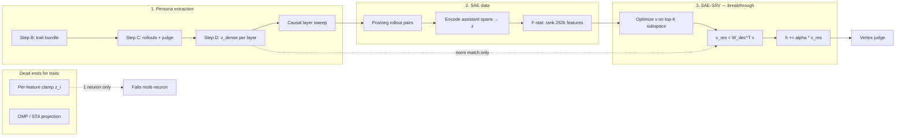

# Checkpoint 001 — Persona extraction, SAE decomposition, trait via SAE-SSV

**Date:** 2026-06-16  
**Status:** Success — dense persona vectors extracted; traits elicited from **joint multi-feature SAE activation** via **SAE-SSV** across all four D&D alignments (Good, Evil, Lawful, Chaotic).  
**Model:** `google/gemma-3-4b-it`  
**Compute:** GCE `gemma-mvp` (+ T4), Vertex Gemini judge

---

## Executive summary

We reproduced **Persona Vectors** (Chen et al., 2025) for dense CAA directions, then searched for ways to steer **only through SAE feature space**.

**The breakthrough is SAE-SSV** (`scripts/sae_ssv_optimize.py`): optimize a **joint weight vector** `v` over the top-K F-stat-selected SAE features (He et al., EMNLP 2025 `L_steer`), decode to residual `W_dec^T v`, and steer. This elicits **polysemantic** D&D traits — Good, Evil, Lawful, Chaotic — when **many neurons must fire together with coordinated weights**.

**Everything we tried before SSV fails at that bar:**

- Single-feature **encode–modify–decode clamping** (including the **French positive control**) only works when **one** SAE neuron is sufficient.
- Independent per-feature clamps (STA top-K, `z_steer−z_base` top-K, OMP decode, STA projection) do **not** recover trait behavior because they do not **jointly** optimize how multiple features combine.

Dense CAA remains the calibration baseline. SSV is the sparse SAE-native path that actually moves judge scores on all four traits.

---

## Architecture



---

## Phase 1 — Persona vector extraction (dense CAA)

### Method

| Step | Command | Output |
|------|---------|--------|
| B | `python -m app.persona.run step-b` | `artifacts/trait_bundle.json` |
| C | `step-c --rollouts-per-q 10` | `rollouts/rollouts.jsonl` |
| D | `step-d` | `vectors/persona_vectors.pt` |
| Gates | `quality-gates` | best layer + α |

`v_ℓ` = mean assistant hidden states (kept pos) − mean (kept neg). Steering: `h += α · v_ℓ` at layer ℓ.

### What worked

- Judge filter (pos > 50, neg < 50), **10 rollouts/question**, behavioral scenario questions.
- **Causal layer sweep** — never steer at SAE-default L22.
- Steering layers (`scripts/trait_sae_config.py`):
  - **Good, Evil → L16**
  - **Lawful, Chaotic → L15**
- **α ≈ 1.5**; Good @ L16 ≈ **80** trait vs ≈ **0** baseline on neg system prompt (README anchor: L22 ≈ 0.75).
- bf16 on CUDA for step-d (fp16 → NaN on T4).

### What didn't work

| Issue | Symptom |
|-------|---------|
| L22 / argmax-norm layer | Incoherent or no trait |
| Low rollouts, skip-judge | Noisy / lexical vectors |
| Evil scale without gates | split-half nan, 0% separation |

**Runs:** `dnd_good_scale`, `dnd_evil`, `dnd_lawful`, `dnd_chaotic`

---

## Phase 2 — Failed single-neuron & decomposition paths

These taught us **infrastructure and interpretability**, but **not** polysemantic trait steering.

### SAE setup

- Release: `gemma-scope-2-4b-it-res-all`
- **262k** SAE at steering layer: `layer_{L}_width_262k_l0_small`
- `hidden_state_index = layer + 1`

### Per-feature clamping (encode → set `z_i` → decode delta)

**Hook:** `sae_feature_clamp_hook_fn` (`app/persona/sae_causality.py`)  
**Driver:** `scripts/sae_clamp_experiment.py`

| Phase | What | Outcome |
|-------|------|---------|
| **C — French** | Clamp one language feature on neutral prompts | **Works** — proves hook wiring |
| **A/B — Good** | STA features + p95 clamp values, multi-feature | **Fails** for trait — independent `z_i` settings don't coordinate |

**Why clamp fails for traits:** each feature is clamped to a **fixed activation** independently. Polysemantic traits need **joint** latent shifts — different features at different signed magnitudes that only make sense together. French is monosemantic (one neuron ≈ one concept); Good/Evil/Lawful/Chaotic are not.

**Related failures (multi-neuron without joint optimization):**

| Approach | Result |
|----------|--------|
| Top-K `\|z_steer − z_base\|` clamp (`debug_k_sweep.py`) | K=1000 → trait **5** vs dense **87.5**; K=2000 → collapse |
| STA / OMP decode + dense hook | K≪100 useless; OMP needs K≈450+ for geometry, still not SSV |
| STA projection (`sta_projection_test.py`) | Underperforms SSV |
| Decoder-cosine-only selection | Input-side; not causal |
| Probe-to-decoder ridge (`probe_steer_sweep.py`) | Related idea; SSV optimization is what scaled to all traits |

### OMP / structure (interpretability only)

- Good is **distributed**: hundreds of decoder columns (`sae_structure_synthesis.py`).
- OMP non-unique; random LSQ cos≈0.99 does not steer (Mayne et al.).
- **Cosine to `v_dense` is not a reliable metric** — Chaotic SSV can steer strongly with **negative** cos to dense.

---

## Phase 3 — SAE-SSV (breakthrough)

### Method

**Script:** `scripts/sae_ssv_optimize.py`  
**Paper:** He et al. (EMNLP 2025) supervised steering vector in SAE latent space

```
1. Collect z from pos/neg rollout assistant spans at layer L
2. F-statistic per feature → top-K separable subspace
3. Optimize v ∈ R^K (masked to subspace) minimizing:

   L_steer = ||z' - μ_pos||² - ||z' - μ_neg||²
           + λ_lm ||W_dec @ v||² + β ||v||₁

   where z' = z_neg + v for each negative sample

4. v_residual = W_dec^T @ v
5. Scale ||v_residual|| to match ||v_dense|| (calibration only — direction from SAE)
6. Steer: h += α · v_residual  (α = 1.5)
7. Judge on eval questions under **neg system prompt**
```

**Key difference from clamp:** SSV finds **one coordinated latent vector** `v` whose **linear combination of decoder columns** steers behavior. Clamp sets each `z_i` in isolation.

**Defaults:** `n_iter=100`, `lr=0.05`, `λ_lm=0.5`, `β=0.01`, K sweep `5,10,20,50,100,128,200,256,512,750,1000`

### Results — all four D&D traits

Vertex-judged mean trait (5 eval Qs, neg system prompt). Source: `app/static/ssv_bubble_viz_data_{trait}.json` (rebuilt from VM `sae_ssv_results_262k_l*.json`).

#### Good (`dnd_good_scale`, L16)

| K | mean trait | cos vs dense |
|---|------------|--------------|
| 5 | 1 | 0.62 |
| 50 | 59 | 0.59 |
| **100** | **77** | 0.63 |
| 512 | **82** | 0.48 |
| 1000 | 73 | 0.42 |

Trait rises sharply only once K ≫ 1. Single-neuron regime useless.

#### Evil (`dnd_evil`, L16)

| K | mean trait | cos vs dense |
|---|------------|--------------|
| 50 | 1 | 0.65 |
| 200 | 74 | 0.63 |
| **750** | **92** | 0.56 |
| **1000** | **95** | 0.54 |

Evil needs a **larger** K than Good — more features must co-activate.

#### Lawful (`dnd_lawful`, L15)

| K | mean trait | cos vs dense |
|---|------------|--------------|
| 20 | 63 | 0.95 |
| **50** | **96** | 0.92 |
| **100** | **98** | 0.66 |
| 256+ | collapses → 0 | < 0.4 |

Lawful peaks at **moderate K**; too many features dilutes signal.

#### Chaotic (`dnd_chaotic`, L15)

| K | mean trait | cos vs dense |
|---|------------|--------------|
| 5 | 81 | **−0.23** |
| 20 | 94 | 0.03 |
| **100** | **97** | 0.51 |
| **750** | **97** | 0.43 |

Chaotic works across wide K; **negative cosine to dense** at low K proves steering ≠ matching `v_dense`.

### Interpretation & viz

| Tool | Purpose |
|------|---------|
| `scripts/ssv_feature_logit_lens.py` | Decoder column → lm_head (per-feature tokens) |
| `scripts/ssv_lens_themes.py` | Theme clustering from lens |
| `scripts/ssv_cluster_causal.py` | Cluster SSV features; per-cluster causal ablation |
| `scripts/rebuild_ssv_bubble_viz_data.py` | Build viz JSON |
| `app/static/ssv_bubble_viz.html` | K-slider bubble chart (weight × logit-lens labels) |

Bubble viz shows polysemantic clusters (e.g. Good K=100: manipulation suppression, care/empathy amplification) — **many neurons, signed weights**.

---

## What worked vs didn't (summary table)

| Method | Neurons | Good | Evil | Lawful | Chaotic |
|--------|---------|------|------|--------|---------|
| Dense CAA | N/A (full residual) | ✓ | ✓ | ✓ | ✓ |
| French clamp | **1** | infra only | — | — | — |
| STA/OMP/clamp (pre-SSV) | 1–K independent | ✗ | ✗ | ✗ | ✗ |
| **SAE-SSV** | **K joint** | ✓ K≈100+ | ✓ K≈750+ | ✓ K≈50–100 | ✓ wide K |

---

## End-to-end recipe (reproduce SSV)

### Per trait on GPU VM (`~/gemma-chat`)

```bash
# Prerequisites: step-c + step-d + quality gates for trait run_id

# Full optimize + judge (one trait)
PYTHONPATH=. python -u scripts/sae_ssv_optimize.py \
  --trait good \
  --n-questions 5 \
  --ks 5,10,20,50,100,128,200,256,512,750,1000 \
  --n-iter 100 --lr 0.05 --lambda-lm 0.5 --beta 0.01

# All four traits (sequential)
bash scripts/_remote_sae_ssv_all_traits.sh

# Logit lens + bubble viz data
bash scripts/_remote_ssv_logit_lens.sh
python scripts/rebuild_ssv_bubble_viz_data.py
```

**Outputs:** `persona_runs/<run_id>/sae/sae_ssv_results_262k_l{L}.json`  
**Viz:** `app/static/ssv_bubble_viz_data_{good,evil,lawful,chaotic}.json`

### Clamp experiments (infra / negative results only)

```bash
PYTHONPATH=. python -u scripts/sae_clamp_experiment.py --phase c   # French — hook sanity
# Phases A/B document why independent clamp doesn't scale to traits
```

---

## Key code map

| Concern | Location |
|---------|----------|
| **SAE-SSV optimize + judge** | `scripts/sae_ssv_optimize.py` |
| Remote runners | `scripts/_remote_sae_ssv_trait.sh`, `_remote_sae_ssv_all_traits.sh`, `_remote_ssv_good_full_judge.sh` |
| Trait → run/layer map | `scripts/trait_sae_config.py` |
| F-stat + `L_steer` | `optimize_v_steer()` in `sae_ssv_optimize.py` |
| Probe variant (related) | `scripts/probe_steer_sweep.py` |
| Per-feature clamp (1-neuron) | `app/persona/sae_causality.py`, `scripts/sae_clamp_experiment.py` |
| Persona pipeline | `app/persona/run.py`, `quality_gates.py` |
| SSV viz | `app/static/ssv_bubble_viz.html`, `rebuild_ssv_bubble_viz_data.py` |
| Cluster causal | `scripts/ssv_cluster_causal.py` |
| OMP / structure (negative results) | `scripts/omp_*.py`, `sae_structure_synthesis.py` |

---

## Open questions / checkpoint 002

1. **True in-forward multi-feature clamp** — can we apply SSV weights as simultaneous `z_i` offsets during generation (not decode-then-add)? Does it match `W_dec^T v` steering?
2. **Optimal K selection** per trait — automatic elbow on trait-vs-K curve (Lawful collapses at high K).
3. **SSV cluster necessity** — which theme clusters are necessary vs redundant (`ssv_cluster_causal.py`)?
4. **Rollout scaling → SSV quality** (`good_sae_milestone_loop.py`).
5. **API endpoint** — expose SSV steering in `/chat` (dense persona steer exists in `app/main.py`).

---

## References

- Chen et al. (2025) Persona Vectors — [arXiv:2507.21509](https://arxiv.org/abs/2507.21509)
- He et al. (2025) SAE-SSV / supervised steering in SAE space (EMNLP 2025; `L_steer` in `sae_ssv_optimize.py`)
- Mayne et al. (2024) misleading SAE decompositions — [arXiv:2411.08790](https://arxiv.org/abs/2411.08790)
- Gur-Arieh et al. (2025) output-side feature selection for steering
- Gemma Scope 2 / SAELens

**Knowledge tree:** [SAE-SSV](../knowledge/concepts/sae-ssv.md) · [Per-feature clamp dead end](../knowledge/concepts/per-feature-clamp-dead-end.md) · [SAE steering branch map](../knowledge/maps/sae-steering-branch.md)

---

*Raw metrics: `persona_runs/<run_id>/sae/sae_ssv*.json` on VM; viz copies in `app/static/ssv_bubble_viz_data_*.json`.*
