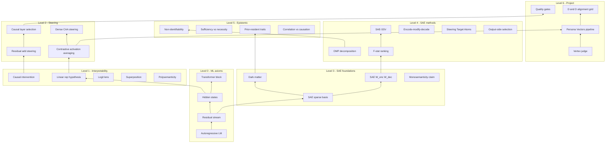

# Knowledge Tree

Hierarchical map of concepts, papers, and methods used in the Persona Selection Model project. Built bottom-up from axioms; each node links to parent prerequisites, child dependents, papers, and repo code.

**Conventions:** See [`_template.md`](_template.md) for concept schema, [`_paper_template.md`](_paper_template.md) for papers. Status: `stub` → `draft` → `complete`.

## Curated views

- [Project-only subtree](maps/project-only-subtree.md) — pipeline path for new contributors
- [SAE steering branch](maps/sae-steering-branch.md) — sparse methods + dead ends

## Build status

| Category | Count | Complete | Draft | Stub |
|----------|------:|---------:|------:|-----:|
| Axioms / foundations | 9 | 9 | 0 | 0 |
| Concepts | 35 | 30 | 2 | 3 |
| Papers / resources | 18 | 18 | 0 | 0 |
| **Total nodes** | **62** | **57** | **2** | **3** |

## Architecture overview

---

## Axioms & foundations

| Node | Level | Status |
|------|-------|--------|
| [Autoregressive LM](axioms/autoregressive-lm.md) | axiom | complete |
| [Residual stream](axioms/residual-stream.md) | axiom | complete |
| [Hidden states](axioms/hidden-states.md) | axiom | complete |
| [Transformer block](axioms/transformer-block.md) | axiom | complete |
| [Linear representation hypothesis](axioms/linear-representation-hypothesis.md) | foundation | complete |
| [Causal intervention on activations](axioms/causal-intervention-on-activations.md) | foundation | complete |
| [Logit lens](axioms/logit-lens.md) | foundation | complete |
| [Superposition](axioms/superposition.md) | foundation | complete |
| [Polysemanticity](axioms/polysemanticity.md) | foundation | complete |

---

## Concepts — steering & pipeline

| Node | Level | Status |
|------|-------|--------|
| [Contrastive activation averaging](concepts/contrastive-activation-averaging.md) | method | complete |
| [Residual add steering](concepts/residual-add-steering.md) | method | complete |
| [Causal layer selection](concepts/causal-layer-selection.md) | method | complete |
| [Dense CAA steering](concepts/dense-caa-steering.md) | method | complete |
| [Persona Vectors pipeline](concepts/persona-vectors-pipeline.md) | project | complete |
| [Step B: trait bundle](concepts/step-b-trait-bundle.md) | project | complete |
| [Step C: rollouts and judge](concepts/step-c-rollouts-judge.md) | project | complete |
| [Step D: vector extraction](concepts/step-d-vector-extraction.md) | project | complete |
| [Vertex judge behavioral scoring](concepts/vertex-judge-behavioral-scoring.md) | project | complete |
| [Quality gates](concepts/quality-gates.md) | project | complete |
| [Coherence alpha sweep](concepts/coherence-alpha-sweep.md) | project | complete |
| [D&D alignment grid](concepts/dnd-alignment-grid.md) | project | complete |
| [Vector composition](concepts/vector-composition.md) | project | complete |
| [Gate self-chat experiment](concepts/gate-self-chat.md) | project | complete |

---

## Concepts — SAE & sparse steering

| Node | Level | Status |
|------|-------|--------|
| [SAE sparse basis](concepts/sae-sparse-basis.md) | method | complete |
| [SAE W_enc / W_dec](concepts/sae-enc-dec.md) | method | complete |
| [Reconstruction error / dark matter](concepts/reconstruction-error-dark-matter.md) | meta | complete |
| [Monosemanticity claim](concepts/monosemanticity-claim.md) | foundation | complete |
| [F-stat feature ranking](concepts/f-stat-feature-ranking.md) | method | complete |
| [SAE-SSV](concepts/sae-ssv.md) | method | complete |
| [Encode-modify-decode clamp](concepts/encode-modify-decode-clamp.md) | method | complete |
| [OMP decomposition](concepts/omp-decomposition.md) | method | complete |
| [Steering Target Atoms](concepts/steering-target-atoms.md) | method | complete |
| [Output-side feature selection](concepts/output-side-feature-selection.md) | method | complete |
| [Logit lens features](concepts/logit-lens-features.md) | method | complete |
| [Per-feature clamp dead end](concepts/per-feature-clamp-dead-end.md) | method | complete |

---

## Concepts — epistemic & field expansion

| Node | Level | Status |
|------|-------|--------|
| [Non-identifiability](concepts/non-identifiability.md) | meta | complete |
| [Sufficiency vs necessity](concepts/sufficiency-vs-necessity.md) | meta | complete |
| [Prior-resident traits](concepts/prior-resident-traits.md) | meta | complete |
| [Correlation vs causation](concepts/correlation-vs-causation.md) | meta | complete |
| [Contrastive diff vs trait content](concepts/contrastive-diff-vs-trait-content.md) | meta | complete |
| [Post-intervention recovery](concepts/post-intervention-recovery.md) | meta | complete |
| [Activation patching](concepts/activation-patching.md) | method | draft |
| [Sparse feature circuits](concepts/sparse-feature-circuits.md) | method | stub |
| [Concept manifolds](concepts/concept-manifolds.md) | foundation | stub |
| [CorrSteer](concepts/corrsteer.md) | method | draft |
| [SAE-TS](concepts/sae-ts.md) | method | stub |

---

## Papers & resources

| Node | Status |
|------|--------|
| [Chen et al. 2025 — Persona Vectors](papers/chen-2025-persona-vectors.md) | complete |
| [He et al. 2025 — SAE-SSV](papers/he-2025-sae-ssv.md) | complete |
| [Mayne et al. 2024 — SAE decomposition](papers/mayne-2024-sae-decomposition.md) | complete |
| [Arad et al. 2025 — SAE steering features](papers/arad-2025-sae-steering-features.md) | complete |
| [Gur-Arieh et al. 2025 — output features](papers/gur-arieh-2025-output-features.md) | complete |
| [Cui et al. 2026 — post-intervention recovery](papers/cui-2026-sae-interventions.md) | complete |
| [Engels et al. 2024 — SAE dark matter](papers/engels-2024-sae-dark-matter.md) | complete |
| [Non-identifiability 2026](papers/non-identifiability-2026.md) | complete |
| [Soo et al. 2025 — CorrSteer](papers/soo-2025-corrsteer.md) | complete |
| [Bricken — STA](papers/bricken-sta.md) | complete |
| [GradSAE 2025](papers/gradsae-2025.md) | complete |
| [SAE-TS — Chalnev et al.](papers/sae-ts-chalnev.md) | complete |
| [Concept manifolds 2025](papers/concept-manifolds-2025.md) | complete |
| [SAE stethoscope 2025](papers/sae-stethoscope-2025.md) | complete |
| [Gemma Scope 2 / SAELens](papers/gemma-scope-2-saelens.md) | complete |
| [Nanda & Heimersheim — patching](papers/nanda-heimersheim-patching.md) | complete |
| [Marks et al. — sparse circuits](papers/marks-sparse-circuits.md) | complete |
| [OpenReview SAE decomposition](papers/openreview-sae-decomposition.md) | complete |

---

## How to extend

1. Copy [`_template.md`](_template.md) into `axioms/` or `concepts/`.
2. Write parents before children; back-link "Used by" on parents.
3. Add or update paper node in `papers/`; cross-link concepts ↔ papers.
4. Update this README status table.
5. Tie new checkpoints in [`../checkpoints/`](../checkpoints/) to concept nodes.

## Related docs

- [Research README](../README.md) — checkpoint index
- [Checkpoint 001](../checkpoints/001-sae-persona-steering.md) — SAE-SSV success
- [Checkpoint 002](../checkpoints/002-interpretability-causation-steering-conflict.md) — epistemic limits
- [Project README](../../README.md) — production pipeline

## Known doc conflicts (tracked in nodes)

- **Layer defaults:** Checkpoint 001 records Good/Evil at L16, Lawful/Chaotic at L15; `scripts/trait_sae_config.py` defaults all traits to L15. **Resolution:** prefer per-trait `validation_report.json` `recommended_layer` — documented in [Causal layer selection](concepts/causal-layer-selection.md).
