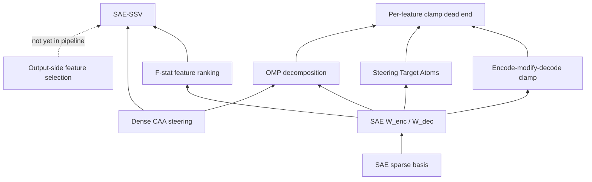

# SAE Steering Branch

Curated view: sparse autoencoder methods for trait steering, including dead ends.

## Method comparison (this repo)

| Method | Multi-neuron traits | Interpretable | Status |
|--------|---------------------|---------------|--------|
| Dense CAA | N/A (full dim) | Low | ✓ baseline |
| Per-feature clamp | ✗ | Medium | Dead end |
| OMP d-sweep | Partial (evil/lawful) | Medium | Negative for good/chaotic |
| STA projection | ✗ | Medium | Dead end |
| **SAE-SSV** | ✓ all four traits | Medium | **Breakthrough** |

## Epistemic limits (read after methods)

- [Prior-resident traits](../concepts/prior-resident-traits.md)
- [Non-identifiability](../concepts/non-identifiability.md)
- [Reconstruction error / dark matter](../concepts/reconstruction-error-dark-matter.md)

## Key code

- `scripts/sae_ssv_optimize.py` — SSV
- `scripts/ssv_omp_dsweep.py` — OMP d-sweep
- `scripts/sae_clamp_experiment.py` — clamp negative results
- `app/persona/sae_causality.py` — hook implementations
