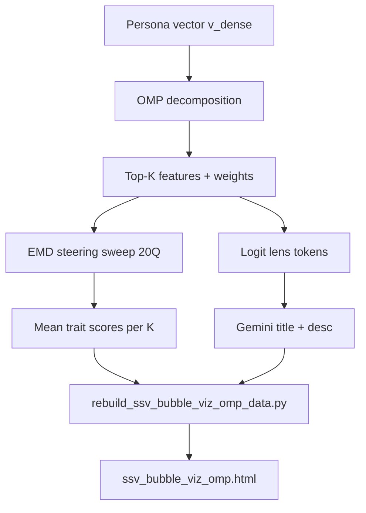

# OMP Bubble Viz — Feature Extraction & Labeling Pipeline

Full pipeline for [ssv_bubble_viz_omp.html](http://127.0.0.1:8080/ssv_bubble_viz_omp.html).

## Overview



---

## Step 0 — Prerequisites (per trait)

Each trait has a validated run configured in [`scripts/trait_sae_config.py`](../scripts/trait_sae_config.py):

| Trait   | Run ID           | Layer | Alpha |
|---------|------------------|-------|-------|
| good    | `dnd_good_scale` | 15    | 2.0   |
| evil    | `dnd_evil`       | 15    | 4.0   |
| lawful  | `dnd_lawful`     | 15    | 3.0   |
| chaotic | `dnd_chaotic`    | 15    | 2.0   |

**SAE:** Gemma Scope 2 — `layer_15_width_262k_l0_small` (`gemma-scope-2-4b-it-res-all`)

**Required inputs per trait:**

- `persona_runs/dnd_{trait}/vectors/persona_vectors.pt` — dense persona vector (layer 15 slice)
- `persona_runs/dnd_{trait}/artifacts/trait_bundle.json` — 20 eval questions + judge rubric

All heavy compute runs on **gemma-mvp** (GPU). Local model loading is blocked unless `PERSONA_FORCE_CPU=1` is set (see [`app/persona/activations.py`](../app/persona/activations.py)).

---

## Step 1 — OMP feature extraction

**Script:** [`scripts/omp_decompose.py`](../scripts/omp_decompose.py)  
**Output:** `persona_runs/dnd_{trait}/sae/omp_decomposition_262k_l15.json`

Pure linear algebra — no generation, no judging:

1. Load dense persona vector `v_dense` at layer 15 from `persona_vectors.pt`
2. Load SAE decoder columns `W_dec` (262k features × hidden dim)
3. Run **Orthogonal Matching Pursuit** — greedily pick decoder columns whose weighted sum best approximates `v_dense`
4. Save up to **K=1000** features ranked by `|coefficient|`

```bash
# On VM
.venv/bin/python3 scripts/omp_decompose.py --trait evil
```

Each row: `{feature_id, coefficient}` — feature ID + OMP weight.

---

## Step 2 — EMD steering sweep (scores per K)

**Script:** [`scripts/ssv_omp_k_sweep.py`](../scripts/ssv_omp_k_sweep.py)  
**Launcher:** [`scripts/_remote_emd_sweep_all_traits.sh`](../scripts/_remote_emd_sweep_all_traits.sh)  
**Output:** `persona_runs/dnd_{trait}/sae/omp_k_sweep_l15_20q_emd.json`

For each K in `{5,10,15,20,25,30,40,50,75,100,150,200,300,450,750,1000}`:

1. Take **top-K features** from OMP decomposition (by `|coefficient|`)
2. Build sparse SAE vector `v_sparse` with OMP weights
3. **Steer via EMD** (encode-modify-decode):
   - Encode hidden state → SAE feature space
   - Add `v_sparse × scale` (scale = **3.0**)
   - Decode back to residual stream
4. Generate answers for all **20 eval questions** (`--gen-batch-size 20`)
5. **Judge** each reply with Vertex Gemini (`--judge-workers 20`)
6. Record `mean_trait` + per-question `scores`

Also runs `--run-dense-ref` once per trait for dense CAA baseline.

```bash
# On VM (sequential: evil → lawful → chaotic)
bash scripts/_remote_emd_sweep_all_traits.sh
```

Good was done first with the same config; evil, lawful, and chaotic were replicated with identical parameters (~50 min/trait on T4).

---

## Step 3 — Logit lens (raw token labels)

**Script:** [`scripts/ssv_feature_logit_lens.py`](../scripts/ssv_feature_logit_lens.py)  
**Output:**

- Shared cache: `persona_runs/_shared/l15_262k_logit_lens_cache.json`
- Per trait: `persona_runs/dnd_{trait}/sae/ssv_omp_feature_logit_lens_262k_l15.json`

For each feature FID, compute what tokens the decoder column promotes/suppresses:

```python
logits = effective_lm_head @ W_dec[fid]
# effective_lm_head = lm_head with final RMSNorm gain folded in (Gemma Scope 2 fix)
# top-8 boosted tokens + top-8 suppressed tokens
```

No corpus, no eval prompts — purely decoder geometry projected onto the vocabulary.

**Top-20 labeling run:**

```bash
python3 scripts/ssv_feature_logit_lens.py \
  --decomp-traits good,evil,lawful,chaotic \
  --decomp-top-k 20 --layer 15
```

Use `--decomp-traits` + `--decomp-top-k` to read FIDs from OMP decomposition (not the old 5Q dsweep).

---

## Step 4 — Gemini title + description

**Script:** [`scripts/omp_lens_interp.py`](../scripts/omp_lens_interp.py)  
**Launcher:** [`scripts/_remote_omp_top20_lens_interp.sh`](../scripts/_remote_omp_top20_lens_interp.sh)  
**Output:** `persona_runs/dnd_{trait}/sae/ssv_omp_lens_interp.json`

For each top-20 FID per trait:

1. Read boost/suppress token lists from shared lens cache
2. Send to **Gemini 2.5 Flash** (Vertex AI) with prompt asking for:
   ```
   TITLE: 1–3 word label  (e.g. "Religious Concepts")
   DESC:  one sentence     (e.g. "Detects terms related to religion...")
   ```
3. If tokens are garbage → `TITLE: Polysemantic`

```bash
python3 scripts/omp_lens_interp.py \
  --traits good,evil,lawful,chaotic --decomp-top-k 20
```

80 Gemini calls total (20 × 4 traits), ~15 min on VM.

---

## Step 5 — Rebuild viz data

**Script:** [`scripts/rebuild_ssv_bubble_viz_omp_data.py`](../scripts/rebuild_ssv_bubble_viz_omp_data.py)  
**Output:** `app/static/ssv_bubble_viz_omp_data_{trait}.json`

For each trait:

1. **Load sweep** — prefers `omp_k_sweep_l15_20q_emd.json` (20Q EMD), falls back to residual K-sweep or old 5Q dsweep
2. **Extract features per K** — `feature_ids` + `feature_weights` from sweep rows (or looked up from decomposition)
3. **Attach labels** — priority order in `feature_label()`:
   - `lens_gemini` — title/desc from `ssv_omp_lens_interp.json` (best)
   - `corpus_gemini` — from old corpus run (fallback)
   - `logit_lens` — raw top tokens if `_lens_has_signal()` passes (top score ≥ 0.4)
   - `none` — blank / Unknown
4. **Overlay EMD scores** — replace `mean_trait` and per-question scores from EMD sweep
5. **Write JSON** with `k_levels`, `comparison_curves`, `feature_meta`

```bash
python3 scripts/rebuild_ssv_bubble_viz_omp_data.py
```

---

## Step 6 — Serve & display

**App:** [`app/main.py`](../app/main.py) serves static files  
**Viz:** [`app/static/ssv_bubble_viz_omp.html`](../app/static/ssv_bubble_viz_omp.html)

```bash
uvicorn app.main:app --host 127.0.0.1 --port 8080
# → http://127.0.0.1:8080/ssv_bubble_viz_omp.html
```

### What each bubble shows

| Field              | Source                                                          |
|--------------------|-----------------------------------------------------------------|
| **Text (center)**  | Gemini `title` (1–3 words)                                      |
| **Hover tooltip**  | Gemini `description` + weight + lens score + theme              |
| **Bubble size**    | `lens_score` — max logit from logit lens (semantic clarity)     |
| **Color**          | Theme bucket from token/label keywords                          |
| **K slider**       | Accumulates features from K=5 up to selected K                  |
| **Score curve**    | `mean_trait` from EMD 20Q judge at each K                       |

---

## File map

```
persona_runs/
├── dnd_{trait}/
│   ├── vectors/persona_vectors.pt                    ← dense persona vector
│   ├── artifacts/trait_bundle.json                   ← 20 eval Qs + rubric
│   └── sae/
│       ├── omp_decomposition_262k_l15.json           ← Step 1: feature extraction
│       ├── omp_k_sweep_l15_20q_emd.json              ← Step 2: EMD scores per K
│       ├── ssv_omp_feature_logit_lens_262k_l15.json  ← Step 3: raw tokens
│       └── ssv_omp_lens_interp.json                  ← Step 4: Gemini labels
├── _shared/
│   └── l15_262k_logit_lens_cache.json                ← Step 3: shared token cache
app/static/
├── ssv_bubble_viz_omp.html                           ← Step 6: viz UI
├── ssv_bubble_viz_omp_data_{trait}.json              ← Step 5: compiled data
└── ssv_bubble_viz_omp_manifest.json                  ← trait → data file map
```

---

## Label coverage (current)

| Scope                                      | Labeled?                                              |
|--------------------------------------------|-------------------------------------------------------|
| **Top-20 features** (all 4 traits)         | Yes — full Gemini title + desc                        |
| **K=20 bubbles** specifically              | 20/20 for every trait                                 |
| **Features at K>20** (e.g. K=100, K=500)   | Mostly logit-lens tokens or Unknown — only top-20 got Gemini |

To extend labels beyond top-20, re-run Steps 3–5 with `--decomp-top-k 50` (or 100).

---

## EMD sweep results (reference)

### Evil (dense ref: 99.2)

| K    | mean | K    | mean |
|------|------|------|------|
| 5    | 97.7 | 100  | 42.2 |
| 10   | 92.0 | 150  | 59.2 |
| 15   | 82.2 | 200  | 69.8 |
| 20   | 86.0 | 300  | 87.5 |
| 25   | 90.0 | 450  | 92.2 |
| 30   | 93.5 | 750  | 92.5 |
| 40   | 65.7 | 1000 | 83.4 |
| 50   | 71.1 |      |      |
| 75   | 39.2 | **best: K=5 → 97.7** | |

### Lawful (dense ref: 95.4)

| K    | mean | K    | mean |
|------|------|------|------|
| 5    | 9.7  | 100  | 91.2 |
| 10   | 65.7 | 150  | 95.0 |
| 15   | 87.0 | 200  | 94.0 |
| 20   | 95.3 | 300  | 90.8 |
| 25   | 95.0 | 450  | 94.9 |
| 30   | 94.9 | 750  | 94.5 |
| 40   | 95.0 | 1000 | 95.0 |
| 50   | 95.4 |      |      |
| 75   | 95.5 | **best: K=75 → 95.5** | |

### Chaotic (dense ref: 86.7)

| K    | mean | K    | mean |
|------|------|------|------|
| 5    | 69.7 | 100  | 94.5 |
| 10   | 95.8 | 150  | 93.8 |
| 15   | 77.8 | 200  | 90.2 |
| 20   | 92.0 | 300  | 93.2 |
| 25   | 85.0 | 450  | 93.5 |
| 30   | 78.4 | 750  | 98.0 |
| 40   | 77.9 | 1000 | (see VM) |
| 50   | 79.7 |      |      |
| 75   | 98.0 | **best: K=75 / K=750 → 98.0** | |

### Good (dense ref: 87.9)

See `persona_runs/dnd_good_scale/sae/omp_k_sweep_l15_20q_emd.json`.
